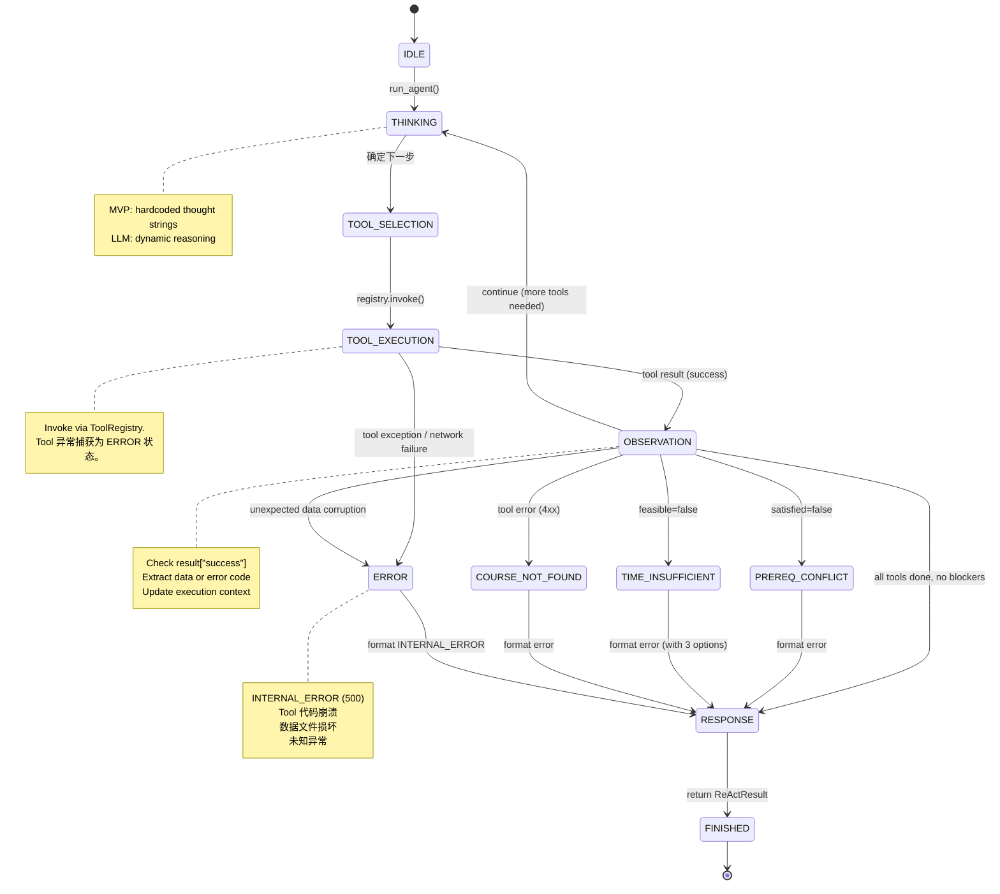

# AI Agent Core Design

| Field | Value |
|-------|-------|
| Version | 1.0.0 |
| Created | 2026-07-11 |
| Status | Draft — awaiting confirmation |
| Milestone | M3: ReAct Agent Core |

---

## 目录

1. [Agent 总体职责](#1-agent-总体职责)
2. [ReAct 工作流](#2-react-工作流)
  2.1 [Trace 设计](#21-trace-设计)
3. [Agent 状态机](#3-agent-状态机)
4. [Tool 调用流程](#4-tool-调用流程)
5. [Prompt 结构](#5-prompt-结构)
  5.1 [变量注入支持](#51-变量注入支持)
6. [Memory（MVP）](#6-memorymvp)
7. [Error Handling](#7-error-handling)
8. [Future Extension](#8-future-extension)

---

## 1. Agent 总体职责

### 1.1 Agent 定位

```
┌─────────────────────────────────────────────────────────────────┐
│                        Agent Core                               │
│                                                                  │
│  职责:                                                           │
│  ✓ 接收用户输入，加载 System Prompt，初始化执行上下文             │
│  ✓ 遵循 ReAct 工作流（Thought → Action → Observation → repeat）  │
│  ✓ 通过 ToolRegistry 调度 Tool（不直接 import）                   │
│  ✓ 检查 Tool 返回结果，决定继续/分支/终止                         │
│  ✓ 组装最终输出（orchestrate the plan）                          │
│                                                                  │
│  不负责:                                                         │
│  ✗ 课程查询 → Tool: get_course_info                              │
│  ✗ 先修验证 → Tool: get_prerequisite                             │
│  ✗ 时间计算 → Tool: calculate_learning_time                      │
│  ✗ 计划生成 → Tool: generate_learning_plan                       │
│  ✗ LLM 推理（MVP）→ 规则化 FSM 模拟                               │
└─────────────────────────────────────────────────────────────────┘
```

### 1.2 与各组件的关系

```
                      ┌──────────────────┐
                      │  System Prompt   │
                      │  (prompts/       │
                      │   system_prompt. │
                      │   txt)           │
                      └────────┬─────────┘
                               │ 加载
                               ▼
┌──────────┐    ┌─────────────────────────────┐    ┌──────────────┐
│   CLI    │───▶│        Agent Core           │───▶│ ToolRegistry │
│  (ui/)   │    │                             │    │  (agent/)    │
└──────────┘    │  ┌───────────────────────┐  │    └──────┬───────┘
                │  │ ReAct FSM             │  │           │
                │  │ (rule-based for MVP)  │  │           ▼
                │  └───────────────────────┘  │    ┌──────────────┐
                │                             │    │  4 Tools     │
                │  ┌───────────────────────┐  │    │  (tools/)    │
                │  │ Prompt Loader         │  │    └──────────────┘
                │  └───────────────────────┘  │
                │                             │
                │  ┌───────────────────────┐  │
                │  │ Exception Handler     │  │
                │  └───────────────────────┘  │
                └─────────────────────────────┘
                               │
                               ▼
                      ┌──────────────────┐
                      │  Final Response  │
                      │  (to CLI/User)   │
                      └──────────────────┘

Agent ↔ ToolRegistry: Agent 通过 registry.invoke(name, **kwargs) 调用 Tool。
                       Agent 不知道 Tool 的具体实现，只知道名称和调用约定。

Agent ↔ Prompt:       Agent 启动时加载 System Prompt。
                       Agent 将 Tool 返回结果格式化为 Observation 追加到上下文。

Agent ↔ Workflow:     Agent 的 FSM 内嵌了 Workflow 顺序：
                       get_course_info → get_prerequisite → calculate_learning_time
                       → generate_learning_plan → final_answer。
                       MVP 是硬编码序列；LLM 模式改为动态推理。

Agent ↔ CLI:          CLI 调用 runner.run_agent()。
                       Agent 返回 ReActResult（含 success + plan/error + trace）。
```

---

## 2. ReAct 工作流

### 2.1 核心循环

```
┌──────────────────────────────────────────────────────────────┐
│                     ReAct Loop                               │
│                                                              │
│   ┌──────────┐     ┌──────────┐     ┌──────────────┐        │
│   │ THOUGHT  │────▶│  ACTION  │────▶│ OBSERVATION  │        │
│   └──────────┘     └──────────┘     └──────┬───────┘        │
│        ▲                                   │                │
│        └─────────── repeat ────────────────┘                │
│                         │                                    │
│                    (enough info?)                            │
│                     YES │                                    │
│                    ┌─────▼──────┐                            │
│                    │   FINAL    │                            │
│                    │   ANSWER   │                            │
│                    └────────────┘                            │
└──────────────────────────────────────────────────────────────┘
```

### 2.2 每一步职责

| 步骤 | 职责 | MVP 实现 | LLM 模式 |
|------|------|---------|---------|
| **Thought** | 分析当前状态，决定下一步行动。需要什么信息？哪个 Tool 能提供？是否有阻断条件？ | 预定义字符串（硬编码在 FSM 的每个状态中） | LLM 根据 System Prompt + 累积上下文动态推理 |
| **Action** | 选择并调用 Tool。通过 ToolRegistry.invoke() 执行。 | FSM 查找当前状态对应的 Tool 名称，从上下文构建参数 | LLM 生成 function_call JSON |
| **Observation** | 处理 Tool 返回结果。检查 success 标志。判断是否有阻断条件（satisfied=false → PREREQ_CONFLICT, feasible=false → TIME_INSUFFICIENT）。更新执行上下文。 | 检查 `result["success"]`，提取 data 或 error 分支 | LLM 解析 tool_result，更新推理链 |
| **Final Answer** | 所有 Tool 调用完成且无阻断 → 组装最终输出。包含完整学习计划。 | 组装所有 Observation 数据为 ReActResult | LLM 根据 System Prompt 的输出格式生成自然语言响应 |

### 2.3 MVP 与 LLM 的差异

| 方面 | MVP (Rule-based FSM) | LLM (Future) |
|------|---------------------|--------------|
| Thought 生成 | 硬编码字符串模板 | LLM 动态推理 |
| Tool 选择 | FSM 状态机预定义 | LLM 根据上下文选择 |
| 循环控制 | 固定 4 步序列 | 动态次数（LLM 自主决定何时结束） |
| 异常处理 | FSM 分支（if satisfied=false → PREREQ_CONFLICT） | LLM 理解 Tool 返回结果并自主决策 |
| 可替换性 | — | 子类化 ReActController，覆写 `_reason()` 方法 |

### 2.1 Trace 设计

每次 ReAct 循环产生的 Trace 记录，用于调试、审计和答辩展示。

**TraceEntry 结构:**

```python
{
    "step": 1,                          # 步骤序号 (1-based)
    "state": "TOOL_EXECUTION",          # Agent FSM 状态
    "action": "get_course_info",        # Tool 名称 (or "thinking"/"final_answer")
    "tool": "get_course_info",          # 调用的 Tool（与 action 相同，thinking 时为 null）
    "input": {"course_name": "Python"}, # Tool 输入参数 (or null)
    "output_summary": {                 # 输出摘要（完整 output 可能过大，只取关键字段）
        "success": true,
        "data_keys": ["id", "name", "hours", ...],
    },
    "timestamp": "2026-07-11T15:30:00.123Z",  # ISO 8601 毫秒
    "elapsed_ms": 2,                           # 本步骤耗时（毫秒）
}
```

**Trace 示例（完整 4 步）:**

```json
[
    {
        "step": 1, "state": "TOOL_EXECUTION", "action": "get_course_info",
        "tool": "get_course_info", "input": {"course_name": "Python"},
        "output_summary": {"success": true, "data_keys": ["id","name","hours","difficulty","prerequisite","description","category","topics"]},
        "timestamp": "2026-07-11T15:30:00.123Z", "elapsed_ms": 2
    },
    {
        "step": 2, "state": "TOOL_EXECUTION", "action": "get_prerequisite",
        "tool": "get_prerequisite", "input": {"course_name": "Python", "user_knowledge": []},
        "output_summary": {"success": true, "satisfied": true, "missing": [], "total_hours": 0},
        "timestamp": "2026-07-11T15:30:00.128Z", "elapsed_ms": 5
    },
    {
        "step": 3, "state": "TOOL_EXECUTION", "action": "calculate_learning_time",
        "tool": "calculate_learning_time", "input": {"course_name": "Python", "daily_hours": 3, "duration_days": 12},
        "output_summary": {"success": true, "feasible": true, "buffer_hours": 12},
        "timestamp": "2026-07-11T15:30:00.133Z", "elapsed_ms": 3
    },
    {
        "step": 4, "state": "TOOL_EXECUTION", "action": "generate_learning_plan",
        "tool": "generate_learning_plan", "input": {"course_name": "Python", "daily_hours": 3, "duration_days": 12},
        "output_summary": {"success": true, "modules": 7, "days": 10, "resources": 9},
        "timestamp": "2026-07-11T15:30:00.145Z", "elapsed_ms": 12
    },
    {
        "step": 5, "state": "RESPONSE", "action": "final_answer",
        "tool": null, "input": null,
        "output_summary": {"success": true, "plan_id": "uuid..."},
        "timestamp": "2026-07-11T15:30:00.145Z", "elapsed_ms": 0
    }
]
```

**Error Trace 示例:**

```json
[
    {
        "step": 1, "state": "TOOL_EXECUTION", "action": "get_course_info",
        "tool": "get_course_info", "input": {"course_name": "Spark"},
        "output_summary": {"success": true, "name": "Spark", "hours": 40},
        "timestamp": "...", "elapsed_ms": 1
    },
    {
        "step": 2, "state": "TOOL_EXECUTION", "action": "get_prerequisite",
        "tool": "get_prerequisite", "input": {"course_name": "Spark", "user_knowledge": []},
        "output_summary": {"success": true, "satisfied": false, "missing": ["Python","Hadoop","Linux","Java"]},
        "timestamp": "...", "elapsed_ms": 3
    },
    {
        "step": 3, "state": "PREREQ_CONFLICT", "action": "error",
        "tool": null, "input": null,
        "output_summary": {"blocked": true, "reason": "先修条件不满足", "total_hours": 112},
        "timestamp": "...", "elapsed_ms": 0
    }
]
```

---

## 3. Agent 状态机

### 3.1 状态定义

```
IDLE ──▶ THINKING ──▶ TOOL_SELECTION ──▶ TOOL_EXECUTION ──▶ OBSERVATION ──▶ RESPONSE ──▶ FINISHED
                                  ▲                          │
                                  │         ┌────────────────┘
                                  │         ▼
                                  └── (异常分支: PREREQ_CONFLICT / TIME_INSUFFICIENT / COURSE_NOT_FOUND)
```

| 状态 | 说明 | 触发条件 |
|------|------|---------|
| `IDLE` | Agent 初始化，等待用户输入 | `run_agent()` 被调用 |
| `THINKING` | Agent 分析当前状态，决定下一步 | 每次循环开始 |
| `TOOL_SELECTION` | 选择要调用的 Tool，构建参数 | THINKING 完成 |
| `TOOL_EXECUTION` | 通过 ToolRegistry 执行 Tool | TOOL_SELECTION 完成 |
| `OBSERVATION` | 检查 Tool 返回结果，判断分支 | TOOL_EXECUTION 返回 |
| `RESPONSE` | 组装最终输出（成功或异常） | 所有步骤完成 或 触发阻断 |
| `FINISHED` | 终端状态，返回结果给 CLI | RESPONSE 完成 |

### 3.2 Mermaid 状态图（含 ERROR）



### 3.3 ERROR 状态说明

| 触发条件 | 来源 | Agent 行为 |
|---------|------|-----------|
| Tool 函数抛出未捕获异常 | TOOL_EXECUTION | Registry 捕获 → 包装为 INTERNAL_ERROR → Agent 转入 ERROR 状态 |
| Tool 返回 success=false, code=INTERNAL_ERROR | OBSERVATION | Agent 转入 ERROR 状态 |
| Tool 返回 success=false, code=DATA_CORRUPTION | OBSERVATION | Agent 转入 ERROR 状态 |
| 数据加载失败（非 Tool 层面） | OBSERVATION | Agent 转入 ERROR 状态 |

**ERROR 是 Terminal State**: 进入 ERROR 后立即转入 RESPONSE，不重试。

### 3.3 FSM 实现策略（MVP）

```python
# 伪代码 — 展示概念，非最终实现

class RuleBasedReActAgent:
    def __init__(self, registry: ToolRegistry):
        self.registry = registry
        self.state = "IDLE"
        self.context = {}  # 累积上下文
        self.trace = []    # 执行追踪

    def run(self, course_name, daily_hours, duration_days, user_knowledge=None):
        self.state = "IDLE"

        # 预定义的执行计划（4 步）
        plan = [
            ("THINKING: lookup course", "get_course_info", {"course_name": course_name}),
            ("THINKING: check prereqs", "get_prerequisite", {"course_name": course_name, "user_knowledge": user_knowledge}),
            ("THINKING: assess time", "calculate_learning_time", {"course_name": course_name, "daily_hours": daily_hours, "duration_days": duration_days}),
            ("THINKING: generate plan", "generate_learning_plan", {"course_name": course_name, "daily_hours": daily_hours, "duration_days": duration_days, "user_knowledge": user_knowledge}),
        ]

        for thought, tool_name, params in plan:
            # → THINKING
            self.state = "THINKING"
            self.trace.append({"thought": thought})

            # → TOOL_SELECTION → TOOL_EXECUTION
            self.state = "TOOL_SELECTION"
            self.trace.append({"action": tool_name, "params": params})

            self.state = "TOOL_EXECUTION"
            result = self.registry.invoke(tool_name, **params)

            # → OBSERVATION
            self.state = "OBSERVATION"
            self.trace.append({"observation_summary": _summarize(result)})

            if self._check_blocker(result, tool_name):
                # → RESPONSE (error path)
                self.state = "RESPONSE"
                return self._build_error_response(result, self.trace)

            # → back to THINKING (continue loop)
            self.context.update(result.get("data", {}))

        # → RESPONSE (success path)
        self.state = "RESPONSE"
        return self._build_success_response(self.context, self.trace)
```

---

## 4. Tool 调用流程

### 4.1 Agent → Registry → Tool

```
┌─────────────────────────────────────────────────────────────────┐
│                     TOOL CALLING FLOW                           │
│                                                                  │
│  Agent                      ToolRegistry              Tool      │
│  ─────                      ────────────              ────      │
│                                                                  │
│  Step 1: THINKING                                               │
│  ┌────────────────────────┐                                     │
│  │ "我需要查询课程信息"     │                                     │
│  └───────────┬────────────┘                                     │
│              │                                                   │
│  Step 2: TOOL_SELECTION                                         │
│  ┌────────────────────────┐                                     │
│  │ tool="get_course_info" │                                     │
│  │ params={course_name}   │                                     │
│  └───────────┬────────────┘                                     │
│              │                                                   │
│              ▼                                                   │
│  ┌───────────────────────────────────────────┐                  │
│  │ registry.invoke("get_course_info",        │                  │
│  │                  course_name="Python")    │                  │
│  └───────────────────┬───────────────────────┘                  │
│                      │                                           │
│                      ▼                                           │
│  ┌──────────────────────────────────────┐                       │
│  │ entry = self._tools.get("get_course_ │                       │
│  │         info")   # O(1) dict lookup  │                       │
│  │                                      │                       │
│  │ if not entry:                        │                       │
│  │     return TOOL_NOT_FOUND error      │                       │
│  │                                      │                       │
│  │ try:                                 │                       │
│  │     return entry.function(**kwargs)  │──────▶ get_course_info│
│  │ except Exception:                    │           ("Python") │
│  │     return INTERNAL_ERROR            │◀────── {"success":   │
│  └──────────────────────────────────────┘        true,         │
│                      │                           "data": {...}}│
│                      ▼                                           │
│  Step 3: OBSERVATION                                            │
│  ┌────────────────────────┐                                     │
│  │ result["success"]=True │                                     │
│  │ data = result["data"]  │                                     │
│  │ context.course = data  │                                     │
│  └───────────┬────────────┘                                     │
│              │                                                   │
│  Step 4: Back to THINKING                                       │
│              │                                                   │
│              ▼                                                   │
│  "先修条件满足，下一步评估可行性"                                  │
└─────────────────────────────────────────────────────────────────┘
```

### 4.2 关键设计决策

| 决策 | 说明 |
|------|------|
| **Agent 不直接 import Tool** | Agent 只依赖 `ToolRegistry` 接口。添加/移除 Tool 无需修改 Agent 代码。 |
| **Tool 不依赖 Agent** | Tool 是纯函数，接收参数返回 dict。不知道 Agent/Workflow/Prompt 的存在。 |
| **Registry 是唯一的调度点** | 所有 Tool 调用通过 `registry.invoke(name, **kwargs)` 统一执行。统一的错误包装和日志。 |
| **解耦验证** | 删除 ToolRegistry，Agent 的 `run()` 方法除了找不到 Tool 以外不会报错（返回 TOOL_NOT_FOUND）。 |

---

## 5. Prompt 结构

### 5.1 提示词分层

```
┌─────────────────────────────────────────────────────────────────┐
│                     PROMPT ARCHITECTURE                          │
│                                                                  │
│  ┌───────────────────────────────────────────────────────────┐  │
│  │  LAYER 1: System Prompt                                    │  │
│  │  (prompts/system_prompt.txt)                                │  │
│  │                                                            │  │
│  │  内容:                                                      │  │
│  │  - Agent 身份 (Course Learning Planner)                    │  │
│  │  - 核心规则 (必须调用 Tool，禁止幻觉)                       │  │
│  │  - 工作流顺序 (Step 1→2→3→4)                               │  │
│  │  - 异常处理规则 (PREREQ_CONFLICT / TIME_INSUFFICIENT)       │  │
│  │  - 输出语言 (中文)                                          │  │
│  │  - 可用 Tool 清单 (名称 + 参数说明)                         │  │
│  │  - ReAct 推理格式要求                                       │  │
│  │                                                            │  │
│  │  加载时机: Agent 初始化时                                   │  │
│  │  模式: 固定（MVP 中作为执行规范，LLM 模式中作为行为约束）    │  │
│  └───────────────────────────────────────────────────────────┘  │
│                                                                  │
│  ┌───────────────────────────────────────────────────────────┐  │
│  │  LAYER 2: User Input                                       │  │
│  │  (CLI args → 格式化后注入)                                   │  │
│  │                                                            │  │
│  │  内容:                                                      │  │
│  │  - course_name: "Python"                                   │  │
│  │  - daily_hours: 3.0                                        │  │
│  │  - duration_days: 12                                       │  │
│  │  - user_knowledge: ["Python"] (optional)                   │  │
│  │                                                            │  │
│  │  注入方式: prompt_loader.format_prompt_with_input()         │  │
│  │  将用户输入嵌入 System Prompt 中的变量占位符                │  │
│  └───────────────────────────────────────────────────────────┘  │
│                                                                  │
│  ┌───────────────────────────────────────────────────────────┐  │
│  │  LAYER 3: Tool Observations (动态累加)                       │  │
│  │  (ReAct 循环中每次 Tool 调用后追加)                          │  │
│  │                                                            │  │
│  │  格式 (ReAct):                                              │  │
│  │  ---                                                        │  │
│  │  Thought: 我需要查询课程信息                                 │  │
│  │  Action: get_course_info                                     │  │
│  │  Action Input: {"course_name": "Python"}                     │  │
│  │  Observation: {"success": true, "data": {"name": "Python",   │  │
│  │                "hours": 24, "difficulty": "beginner", ...}}  │  │
│  │  ---                                                        │  │
│  │                                                            │  │
│  │  累加方式: 每次 Tool 返回后，格式化并 append 到 trace        │  │
│  │  MVP:  上下文以 dict 形式存储在 ReActState 中               │  │
│  │  LLM:  constext 作为 LLM 的对话历史                          │  │
│  └───────────────────────────────────────────────────────────┘  │
│                                                                  │
│  ┌───────────────────────────────────────────────────────────┐  │
│  │  LAYER 4: Final Response                                    │  │
│  │  (Agent → CLI → User)                                       │  │
│  │                                                            │  │
│  │  格式 (System Prompt 规定的输出模板):                        │  │
│  │  # 📚 学习计划: Python                                      │  │
│  │  ## 课程概览                                                │  │
│  │  ## 先修条件检查                                            │  │
│  │  ## 学习路径                                                │  │
│  │  ## 每日计划                                                │  │
│  │                                                            │  │
│  │  MVP:  formatter.py 将 ReActResult 格式化为文本/JSON        │  │
│  │  LLM: LLM 自行按 System Prompt 模板生成                     │  │
│  └───────────────────────────────────────────────────────────┘  │
└─────────────────────────────────────────────────────────────────┘
```

### 5.1 变量注入支持

Prompt Loader 不仅仅是 `open("system_prompt.txt").read()`。它支持在加载时注入动态变量。

**支持的变量:**

| 变量名 | 来源 | 示例值 | 注入时机 |
|--------|------|--------|---------|
| `{{tool_list}}` | `registry.list_tools()` | 格式化的 Tool 清单文本 | Agent 初始化 |
| `{{workflow}}` | Agent FSM 执行计划 | `"Step 1: get_course_info → Step 2: get_prerequisite → ..."` | Agent 初始化 |
| `{{current_date}}` | `datetime.now()` | `"2026-07-11"` | 每次 run_agent() |
| `{{user_input}}` | CLI args | `"课程: Python, 每日: 3h, 周期: 12天"` | 每次 run_agent() |
| `{{output_schema}}` | 硬编码模板 | 输出格式说明文本 | Agent 初始化 |

**注入流程:**

```
System Prompt Template (prompts/system_prompt.txt)
    │
    │  模板中可以包含 {{variable}} 占位符
    │
    ▼
Prompt Loader
    │
    │  load_system_prompt(registry, workflow) → str
    │
    │  1. 读取模板文件
    │  2. registry.list_tools() → 格式化为 tool_list 字符串
    │  3. workflow → 格式化为 workflow 字符串
    │  4. datetime.now() → current_date
    │  5. 硬编码 output_schema
    │  6. str.replace("{{var}}", value) for each var
    │
    ▼
Resolved System Prompt (注入后的完整 Prompt)
```

**为什么这样设计:**

| 传统方式 | 变量注入方式 |
|---------|------------|
| Prompt 写死 Tool 名称 → 添加 Tool 需修改 Prompt | Prompt 引用 `{{tool_list}}` → 注册 Tool 后自动更新 |
| Workflow 变更需改 Prompt 文件 | Workflow 变更只需改 FSM，Prompt 自动跟随 |
| LLM 模式下 Tool 信息过时 | `{{tool_list}}` 实时反映 Registry 状态 |

### 5.2 Prompt 组合流程

```
System Prompt (加载一次)
    │
    ▼
+ User Input (注入变量)
    │
    ▼
┌──────────────────────┐
│  Combined Context    │  ← Agent 初始化时的完整上下文
└──────────┬───────────┘
           │
           ▼ (ReAct Loop 开始)
┌──────────────────────┐
│ + Observation #1     │  ← get_course_info 返回
├──────────────────────┤
│ + Observation #2     │  ← get_prerequisite 返回
├──────────────────────┤
│ + Observation #3     │  ← calculate_learning_time 返回
├──────────────────────┤
│ + Observation #4     │  ← generate_learning_plan 返回
└──────────┬───────────┘
           │
           ▼
     Final Response
```

---

## 6. Memory（MVP）

### 6.1 MVP 决策：不实现 Conversation History

| 考虑因素 | 决策 |
|---------|------|
| **多轮对话** | MVP 不支持。每次 `run_agent()` 是一次独立的、无状态的执行。 |
| **上下文累积** | 单次执行内，通过 `ReActState` 对象在内存中累积 Tool 返回结果。执行结束后丢弃。 |
| **持久化** | MVP 不持久化对话历史。 |
| **Trace 记录** | 每次执行的 `trace` 字段记录完整的 Thought→Action→Observation 序列，保存在返回结果中（非持久化）。 |

### 6.2 为什么 MVP 不需要 Memory

```
MVP 场景:
  User: --course "Python" --hours 3 --days 12
  Agent: 执行 4 步 → 返回完整计划
  Session: 结束

  不需要 Memory 因为:
  1. 学习计划是完整、自包含的（无需追问）
  2. 如果参数不合法 → Agent 返回错误 + 建议，用户修改参数重新调用
  3. 不存在 "先问 A，再问 B，Agent 记住 A 的答案" 的对话场景
```

### 6.3 未来扩展点

```
v1.1 可添加:
  - ConversationHistory: list[dict]  (role/content 格式)
  - 支持用户追问: "这个模块能跳过吗？" → Agent 修改 skip_optional 后重新生成
  - 支持参数修正: "改到每天 4 小时" → Agent 记住 course_name 不变，只改参数
```

---

## 7. Error Handling

### 7.1 错误传播路径

```
Tool 层                Registry 层           Agent 层               CLI 层
───────                ───────────           ────────               ──────

get_course_info()
    │
    ├── 成功
    │   └── {"success": true, "data": {...}}
    │           │
    │           ▼
    │       registry.invoke()
    │           │ 透明传递
    │           ▼
    │       Agent.OBSERVATION
    │           │ context.update(data)
    │           │ 继续下一步
    │           ▼
    │
    ├── 课程不存在
    │   └── {"success": false, "error": {"code": "COURSE_NOT_FOUND", ...}}
    │           │
    │           ▼
    │       registry.invoke()
    │           │ 透明传递
    │           ▼
    │       Agent.OBSERVATION
    │           │ result["success"] = false
    │           │ → 状态 = COURSE_NOT_FOUND (Terminal)
    │           │ → 组装 error response
    │           ▼
    │       CLI
    │           │ 打印错误信息
    │           │ exit(1)
    │
    └── Tool 代码抛异常
        └── Exception("unexpected")
                │
                ▼
            registry.invoke()
                │ except Exception → INTERNAL_ERROR
                ▼
            Agent.OBSERVATION
                │ 同上
```

### 7.2 异常类型与 Agent 行为

| Tool 返回 | Agent 状态 | Agent 行为 |
|----------|-----------|-----------|
| `success=true, satisfied=true` | 继续 | 进入下一步 |
| `success=true, satisfied=false` | PREREQ_CONFLICT (Terminal) | 输出缺失先修课列表 + 预估学时 |
| `success=true, feasible=false` | TIME_INSUFFICIENT (Terminal) | 输出 3 种调整方案 |
| `success=false, code=COURSE_NOT_FOUND` | COURSE_NOT_FOUND (Terminal) | 输出可用课程列表 |
| `success=false, code=VALIDATION_ERROR` | VALIDATION_ERROR (Terminal) | 输出正确输入格式 |
| `success=false, code=INTERNAL_ERROR` | INTERNAL_ERROR (Terminal) | 报告系统错误，终止 |

### 7.3 阻断规则

```
Agent 在每个 OBSERVATION 后检查:

if result["success"] is False:
    → Terminal state (error propagated)

if tool == "get_prerequisite" and result["data"]["satisfied"] is False:
    → Terminal state (PREREQ_CONFLICT)
    → 不继续 calculate_learning_time 和 generate_learning_plan

if tool == "calculate_learning_time" and result["data"]["feasible"] is False:
    → Terminal state (TIME_INSUFFICIENT)
    → 不继续 generate_learning_plan
```

---

## 8. 文件规划

| 文件 | 内容 | M3 状态 |
|------|------|---------|
| `src/agent/react_loop.py` | `ReActController` FSM 实现 | Task 3.2 |
| `src/agent/prompt_loader.py` | `load_system_prompt()` + `format_prompt_with_input()` | Task 3.1 |
| `src/agent/runner.py` | `run_agent()` 顶层入口 | Task 3.3 |
| `src/ui/formatter.py` | `format_plan_output()` 文本/JSON 输出 | M5 |
| `src/ui/cli.py` | argparse CLI 入口 | M5 |

---

## 附录: 关键设计决策

| # | 决策 | 理由 |
|---|------|------|
| 1 | MVP 使用规则化 FSM，非 LLM | 零 API 依赖，确定性输出，LLM 替换接口已预留 |
| 2 | Agent 不 import Tool，通过 Registry 调用 | 解耦，Tool 可独立开发/测试/替换 |
| 3 | 不实现 Conversation History | MVP 场景是单轮请求，无多轮对话需求 |
| 4 | 状态机硬编码 4 步序列 | 工作流固定（课程→先修→可行性→计划），无动态路由需求 |
| 5 | Trace 记录所有步骤 | 可审计性：即使 FSM 是确定性的，trace 提供透明执行记录 |

---

## 8. Future Extension

### 8.1 LLM 模式：动态 Tool 选择

**当前 (MVP):**
```python
# FSM 硬编码 Tool 名称
plan = [
    ("get_course_info", {"course_name": course_name}),
    ("get_prerequisite", {...}),
    ("calculate_learning_time", {...}),
    ("generate_learning_plan", {...}),
]
for tool_name, params in plan:
    result = registry.invoke(tool_name, **params)
```

**Future (LLM):**
```python
# LLM 通过 registry.list_tools() 获取可用 Tool 元数据
tool_schemas = registry.list_tools()
# → [{"name": "get_course_info", "description": "...", "input_schema": {...}}, ...]

# LLM 根据 System Prompt + Context 动态选择 Tool
while not llm_decides_done():
    thought = llm.reason(context, tool_schemas)       # LLM 推理
    tool_call = llm.select_tool(thought, tool_schemas) # LLM 选择 Tool
    result = registry.invoke(tool_call.name, **tool_call.params)
    context.append(Observation(result))
    if agent.check_blocker(result):
        break
```

**替换策略:**
- `RuleBasedReActAgent` 和 `LLMReActAgent` 共享相同的基类接口
- `run(course_name, daily_hours, duration_days, user_knowledge) → ReActResult`
- 仅 `_reason()` 和 `_select_tool()` 方法不同
- ToolRegistry 和 Tool 自身完全不变

### 8.2 多轮对话支持

```
v1.1:
  - Agent 支持追问: "跳过可选模块" / "改 4h/天" 等快速修正
  - ConversationHistory: list[dict] (role/content 格式)
  - 上下文持续累积，无需每次重新输入课程名称

v1.2:
  - 学习进度追踪: 用户标记 "Day 3 完成" → Agent 调整剩余计划
  - 保存/加载计划: SQLite 持久化
```

### 8.3 Multi-Agent 架构

```
v2.0:
  OrchestratorAgent
      ├── CourseExpertAgent (课程分析 + 先修验证)
      ├── SchedulerAgent (时间规划 + 每日分配)
      ├── ResourceCuratorAgent (资源检索 + 推荐)
      └── ProgressTrackerAgent (进度追踪 + 计划调整)

  每个 Sub-Agent 有自己的 System Prompt 和 Tool 子集。
  Orchestrator 通过 ToolRegistry 将任务委派给 Sub-Agent。
```

### 8.4 Remote Tool Provider

```
Future:
  - ResourceProvider → WebResourceProvider: 调用在线 API (Coursera/Udemy/YouTube)
  - ResourceProvider → RAGResourceProvider: 向量检索内部知识库
  - DataLoader → S3DataLoader: 从云端加载课程数据
  - DataLoader → DBDataLoader: 从 PostgreSQL 加载

  所有替换只需实现 Protocol 接口，Agent 零改动。
```
