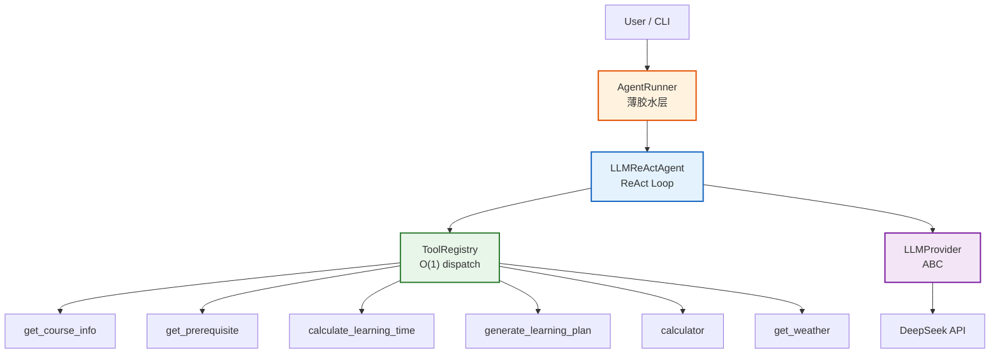
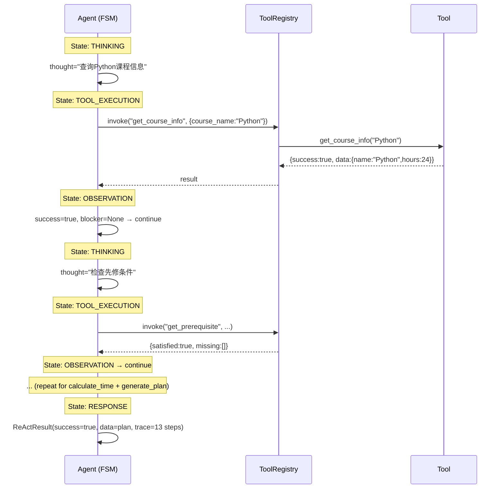
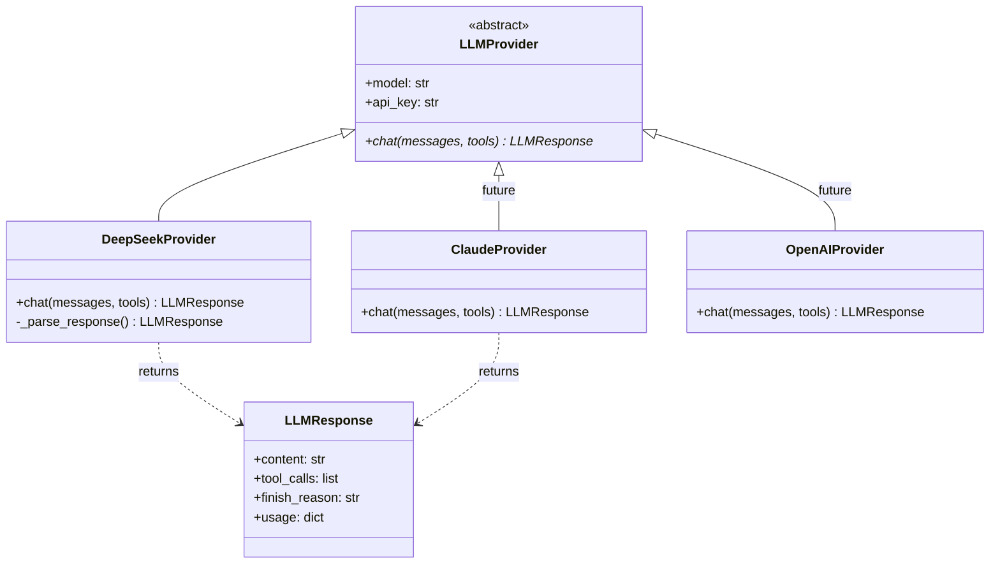
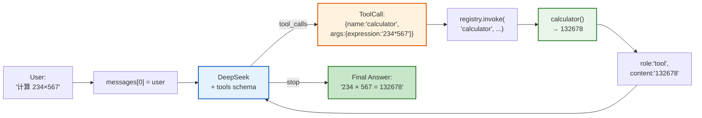
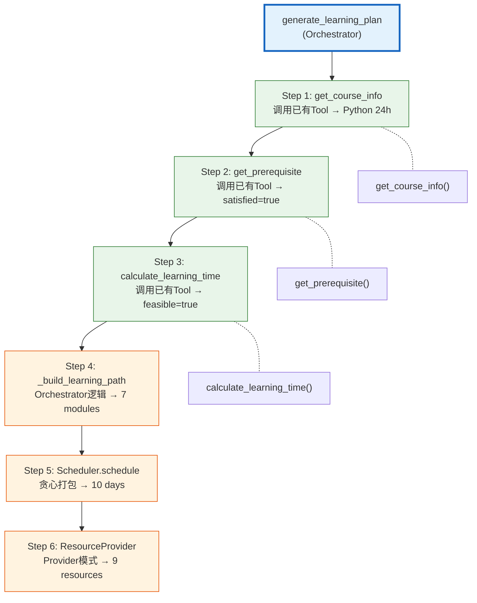

# Course Learning Planner Agent — 10-Minute Technical Defense

---

## Slide 1 — "This is an Agent, not a Chatbot"

| Time | 0:00–1:00 |
|------|-----------|

### Problem → Solution

```
┌──────────────────────────────┬──────────────────────────────────┐
│          CHATBOT             │         THIS AGENT               │
├──────────────────────────────┼──────────────────────────────────┤
│                              │                                  │
│  User: "学Python要多久?"      │  User: "学Python要多久?"          │
│                              │                                  │
│  Bot:  "大约2-3个月"         │  Agent:                          │
│        ↑ Model hallucination │    Step 1: get_course_info()     │
│                              │    Step 2: get_prerequisite()    │
│  No data source              │    Step 3: calculate_time()      │
│  No audit trail              │    Step 4: generate_plan()       │
│  No error handling           │                                  │
│                              │    Answer: "24小时, 7个模块,      │
│                              │    12天完成(3h/天)"              │
│                              │          ↑ Tool output,          │
│                              │            verifiable,           │
│                              │            13-step audit trail   │
└──────────────────────────────┴──────────────────────────────────┘
```

### Code Evidence

```python
# src/tools/course_info.py — Agent NEVER invents course data
def get_course_info(course_name: str) -> dict:
    courses = load_courses()                    # ← JSON file, not model memory
    for course in courses:
        if course.name.lower() == query_lower:  # case-insensitive match
            return {"success": True, "data": course.model_dump()}
    return {"success": False, "error": {"code": "COURSE_NOT_FOUND", ...}}
```

### Speaker Notes

> 传统Chatbot的回答来自模型训练数据——它会告诉你"大约2-3个月"。这个Agent的回答来自Tool调用——`get_course_info('Python')` 返回 `24小时, 7个模块`。每个数字都有数据来源, 每步决策都有Trace记录。区别是根本性的: Chatbot依赖模型记忆, Agent依赖Tool输出。

---

## Slide 2 — "Four Layers, Zero Circular Imports"

| Time | 1:00–2:00 |
|------|-----------|

### System Architecture



### Key Metrics

```
Source:  26 .py files, 3,707 lines     Tests:     162 passed, ~90% coverage
Layers:  4 (providers→agent→tools→models)  Models:    10 Pydantic v2
Imports: 0 circular                      Exceptions: 8 types
```

### Speaker Notes

> 四层架构: Provider → Agent → Tools → Models。依赖方向严格向下, 零循环导入。AgentRunner是薄胶水层, LLMReActAgent是核心循环, ToolRegistry是O(1)调度中心, LLMProvider是抽象基类。26个源文件, 3707行Python, 架构清晰, 模块职责单一。

---

## Slide 3 — "Every Action is Recorded in a 13-step Trace"

| Time | 2:00–3:00 |
|------|-----------|

### ReAct Execution Trace



### Real Trace Output

```
13 trace steps:
  Step  1 | THINKING          | "查询'Python'课程信息..."
  Step  2 | TOOL_EXECUTION    | [get_course_info] (2ms)
  Step  3 | OBSERVATION       | {success:true, data_keys:[id,name,hours,...]}
  Step  4 | THINKING          | "检查用户是否满足'Python'的先修条件。"
  Step  5 | TOOL_EXECUTION    | [get_prerequisite] (6ms)
  Step  6 | OBSERVATION       | {satisfied:true, missing:[]}
  Step  7 | THINKING          | "评估时间可行性: 3.0h/天 × 12天。"
  Step  8 | TOOL_EXECUTION    | [calculate_learning_time] (3ms)
  Step  9 | OBSERVATION       | {feasible:true, buffer_hours:12}
  Step 10 | THINKING          | "所有条件满足，生成完整学习计划。"
  Step 11 | TOOL_EXECUTION    | [generate_learning_plan] (12ms)
  Step 12 | OBSERVATION       | {success:true, plan_id:...}
  Step 13 | RESPONSE          | ReActResult(success=true)
```

### Speaker Notes

> ReAct循环产生13步执行Trace。每步记录8个字段: step, state, thought, selected_tool, tool_input, tool_output, timestamp, elapsed_ms。这不仅是调试工具——这是Agent的完整审计日志。答辩时你可以指着第5步说: '这里Agent检测到satisfied=true, 所以继续执行下一Tool', 指着第13步说: '所有条件满足, 返回完整学习计划'。

---

## Slide 4 — "O(1) Dispatch. Zero if/elif."

| Time | 3:00–4:00 |
|------|-----------|

### Registry Pattern vs Anti-Pattern

```
 ANTI-PATTERN (if/elif chain):           REGISTRY PATTERN (dict):

 def invoke(name, **kwargs):             class ToolRegistry:
     if name == "get_course_info":           _tools: dict[str, ToolEntry] = {}
         return get_course_info(...)
     elif name == "get_prerequisite":    def invoke(self, name, **kwargs):
         return get_prereq(...)              entry = self._tools.get(name)
     elif name == "calculate_time":          if entry is None:
         return calc_time(...)                   return TOOL_NOT_FOUND
     ...  ← grow with every tool             return entry.function(**kwargs)
                                              ↑ O(1) lookup, zero branching
 Adding a tool = editing Agent code.
                                          Adding a tool = registry.register(...)
                                          Agent code: 0 lines changed.
```

### Code Evidence

```python
# src/agent/tool_registry.py
class ToolRegistry:
    def invoke(self, name: str, **kwargs: Any) -> dict:
        entry = self._tools.get(name)           # O(1) dict lookup
        if entry is None:
            return TOOL_NOT_FOUND error
        try:
            return entry.function(**kwargs)      # direct function call
        except Exception as exc:
            return INTERNAL_ERROR

# Adding a new tool — Agent unchanged:
registry.register(ToolEntry(
    name="calculator",
    description="计算数学表达式",
    input_schema={"type": "object", "properties": {...}},
    output_schema={...},
    function=calculator,                         # ← just the function reference
))
```

### Speaker Notes

> 关键设计: Registry用的是Python dict, 不是if/elif链。O(1)字典查找, 零条件分支。加一个新Tool——比如calculator——只需`registry.register(ToolEntry(...))`一行代码。Agent核心代码完全不变。这就是Registry Pattern的核心价值: 扩展性不是"改代码", 是"加注册"。

---

## Slide 5 — "Provider Abstraction Makes LLM Replaceable"

| Time | 4:00–5:00 |
|------|-----------|

### LLMProvider Interface



### Code Evidence

```python
# src/providers/base.py — Agent imports ONLY this file
class LLMProvider(ABC):
    @abstractmethod
    def chat(self, messages: list[dict], tools: list[dict] | None) -> LLMResponse:
        """All providers return the same LLMResponse type."""

# src/providers/deepseek_provider.py — vendor SDK hidden behind ABC
class DeepSeekProvider(LLMProvider):
    def __init__(self, api_key, model="deepseek-chat"):
        self._client = OpenAI(api_key=api_key, base_url="https://api.deepseek.com")

    def chat(self, messages, tools=None) -> LLMResponse:
        try:
            response = self._client.chat.completions.create(...)
        except AuthenticationError:   raise ProviderError("API Key 无效")
        except RateLimitError:        raise ProviderError("速率限制")
        except APITimeoutError:       raise ProviderError("请求超时")
        return self._parse_response(response)  # ← convert SDK → LLMResponse

# Agent code — zero openai/ anthropic imports!
agent = LLMReActAgent(registry, provider)
```

### Speaker Notes

> Agent代码从不import openai或anthropic——它只依赖`LLMProvider(ABC)`。DeepSeekProvider内部使用OpenAI SDK, 因为DeepSeek API完全兼容OpenAI。换Claude? 实现`ClaudeProvider(LLMProvider)`, Agent一行不改。5种异常类型全部映射为中文错误消息。这就是Provider抽象的工程价值: 厂商锁定不存在。

---

## Slide 6 — "LLM Decides. Agent Executes."

| Time | 5:00–6:00 |
|------|-----------|

### Tool Calling Data Flow



### Code Evidence

```python
# src/agent/llm_react.py — the 20-line core loop
tools_schema = to_openai_tools(self.registry)  # ← ToolRegistry → OpenAI schema

for _ in range(self.MAX_TOOL_ROUNDS):          # ← safety: max 10 rounds
    response = self.provider.chat(messages, tools_schema)

    if not response.tool_calls:                # ← LLM says "done"
        return ReActResult(success=True, data={"answer": response.content})

    for tc in response.tool_calls:             # ← LLM wants tools
        result = self.registry.invoke(tc.name, **tc.arguments)
        messages.append({"role": "tool",
                         "tool_call_id": tc.id,
                         "content": json.dumps(result)})
```

### Speaker Notes

> 关键分离: LLM决定调用哪个Tool, Agent负责执行。LLM返回`tool_calls=[...]` → Agent通过Registry执行 → 结果追加到对话 → LLM继续推理 → 直到LLM的`finish_reason="stop"`。Agent不做推理, LLM不直接执行代码。ToolAdapter负责将ToolRegistry的元数据转换为OpenAI Function Calling格式——20行代码完成映射。

---

## Slide 7 — "4 Tools, 1 Orchestrator, Zero Duplication"

| Time | 6:00–7:00 |
|------|-----------|

### Multi-step Workflow



### Real Output

```
[课程] Python: 24h, beginner
[模块] 7 个 (6必修 + 1可选)
[天数] 10 天 (8学习 + 1复习 + 1评估)
[资源] 9 条
[Trace] 13 步
```

### Speaker Notes

> `generate_learning_plan`是编排器, 不是又一个独立Tool。Step 1-3直接调用已有的三个Tool——零代码重复。Step 4-6是编排器独有的逻辑: 构建学习路径、调度每日计划(Scheduler使用贪心打包算法, 每5天插入复习日)、收集资源(ResourceProvider使用Provider模式, 为未来RAG预留接口)。绿色=已有Tool复用, 橙色=编排器独有逻辑。

---

## Slide 8 — "Reliable Execution Requires Safety Constraints"

| Time | 7:00–8:00 |
|------|-----------|

### Safety Mechanisms

```
get_prerequisite("Spark", user_knowledge=[])
    │
    ▼
 satisfied? ──NO──▶ PREREQUISITE_CONFLICT (Terminal)
    │              ├─ missing: [Python, Hadoop, Linux, Java]
    │              ├─ total: 112h
    │              └─ STOP. Do NOT call calculate_learning_time.
    │
   YES
    │
    ▼
calculate_learning_time("Flink", 1, 10)
    │
    ▼
 feasible? ──NO──▶ TIME_INSUFFICIENT (Terminal)
    │              ├─ deficit: 26h
    │              ├─ Option A: extend to 36 days
    │              ├─ Option B: increase to 3.6h/day
    │              ├─ Option C: reduce to 31h (required only)
    │              └─ STOP. Do NOT call generate_learning_plan.
```

### Safety Constraints

| Layer | Constraint | Implementation |
|-------|-----------|---------------|
| Input | Parameter validation | `_validate_input()` in AgentRunner — before Agent loop |
| Recursion | DAG-aware cycle detection | `visited` set in `_expand_prerequisites()` |
| Recursion | Max depth limit | `MAX_RECURSION_DEPTH = 5` |
| Execution | Max tool rounds | `MAX_TOOL_ROUNDS = 10` in LLM agent |
| Tool | 5 exception types | DeepSeekProvider catches Auth/Rate/Timeout/API/Unknown |
| Agent | 2 blocker gates | `blocker_check()` → PREREQ_CONFLICT / TIME_INSUFFICIENT |

### Code Evidence

```python
# DAG-aware shared dependency — not a cycle error
if name_lower in visited:
    return                           # ← skip, don't raise

# Parameter validation before any tool call
if daily_hours < 0.5 or daily_hours > 16:
    return VALIDATION_ERROR

# Loop safety — prevents infinite LLM→Tool→LLM cycles
for _ in range(self.MAX_TOOL_ROUNDS):   # max 10
```

### Speaker Notes

> 可靠性不是靠运气, 是靠约束。输入验证在Agent循环之前拦截非法参数。DAG感知: 共享依赖(Java被Flink和Hadoop同时引用)使用visited集合跳过, 不误报循环错误。递归深度限制5层。LLM Agent最多10轮Tool调用防止死循环。每个Provider必须处理5种异常类型。两个业务阻断点确保Agent不会生成不可能的计划。

---

## Slide 9 — "Every Decision is Auditable"

| Time | 8:00–9:00 |
|------|-----------|

### TraceEntry Structure

```
┌──────────────────────────────────────────────────────────────────┐
│ TraceEntry — 8 fields per step                                   │
├─────────┬──────────────┬───────────┬─────────────┬──────────────┤
│ step: 1 │ state:       │ thought:  │ selected_   │ tool_input:  │
│         │ "THINKING"   │ "查询     │ tool: null  │ null         │
│         │              │ Python    │             │              │
│         │              │ 课程信息" │             │              │
├─────────┼──────────────┼───────────┼─────────────┼──────────────┤
│ step: 2 │ state:       │ thought:  │ selected_   │ tool_input:  │
│         │ "TOOL_EXEC"  │ null      │ tool:       │ {course_name │
│         │              │           │ "get_course │ : "Python"}  │
│         │              │           │ _info"      │              │
├─────────┼──────────────┼───────────┼─────────────┼──────────────┤
│ step: 3 │ state:       │ thought:  │ tool_output │ timestamp:   │
│         │ "OBSERVATION"│ null      │ {success:   │ 2026-07-11   │
│         │              │           │  true,      │ T15:30:00Z   │
│         │              │           │  data_keys: │              │
│         │              │           │  [...]}     │ elapsed: 2ms │
└─────────┴──────────────┴───────────┴─────────────┴──────────────┘
```

### Trace Patterns by Scenario

```
Success:        13 steps  (4 THINK + 4 EXEC + 4 OBS + 1 RESP)
Prereq Conflict:  7 steps  (stops after get_prerequisite)
Time Shortfall:  10 steps  (stops after calculate_learning_time)
```

### Speaker Notes

> Trace不只是日志——它是Agent决策的完整审计记录。成功路径13步, 阻断路径7步或10步。每步8个字段。你可以指着任意一步说: 'Step 5, Agent检测到satisfied=true, 所以继续到可行性评估'。你也可以指着第7步说: 'Step 7, blocker_check返回PREREQUISITE_CONFLICT, 所以Agent立即终止, 避免浪费后续Tool调用'。Trace让Agent的决策过程完全透明。

---

## Slide 10 — "From MVP Agent to Production Architecture"

| Time | 9:00–10:00 |
|------|-----------|

### Extension Roadmap

```
 MVP (now)        v1.1              v1.2              v2.0
 ────────         ────              ────              ────
 ReAct FSM   →   + Memory      →   + RAG          →  Multi-Agent
 LLM Agent        Conversation      Resource Search   协作编排
                  History           Vector Store

 4 + 2 Tools  →  + Progress    →   + Web UI       →  Evaluation
                  Tracker           FastAPI           Benchmark
                                                     Test Suite

 DeepSeek     →  + Claude      →   + OpenAI       →  Local LLM
                  Provider          Provider          Ollama
```

### 3 Core Takeaways

```
1. Agent ≠ Chatbot
   └─ Tool output > Model memory
   └─ get_course_info("Python") → 24h (not "about 2-3 months")

2. Architecture = Extensible
   └─ New Tool: 0 Agent changes
   └─ New Provider: 0 Agent changes
   └─ Rule-based → LLM: 1 line switch

3. Engineering = Reliable
   └─ 162 tests | ~90% coverage
   └─ 8 exception types | DAG-aware recursion
   └─ Full trace audit for every decision
```

### Speaker Notes

> 当前MVP展示了三个核心能力。第一: Agent不是Chatbot——所有信息来自Tool输出, 不是模型记忆。第二: 架构为扩展设计——加Tool零改动Agent, 换Provider零改动Agent, 规则引擎切换到LLM只需一行代码。第三: 工程质量——162个测试, 90%覆盖率, 8种异常类型, DAG感知递归, 每一步可审计。未来方向: Memory支持多轮对话, RAG做智能资源检索, Multi-Agent协作编排, Production部署。

---

## Appendix: Demo Commands

| Scenario | Command | Expected |
|----------|---------|----------|
| Course plan | `python demo.py --course Python` | Success — 7 modules, 10 days |
| Prereq conflict | `python demo.py --prereq` | PREREQUISITE_CONFLICT — 4 missing, 112h |
| LLM calculator | `python demo.py --llm --calculator` | 234 × 567 = 132678 |
| LLM weather | `python demo.py --llm --weather` | Weather + advice |
| All tests | `pytest tests/ -v` | 162 passed |
