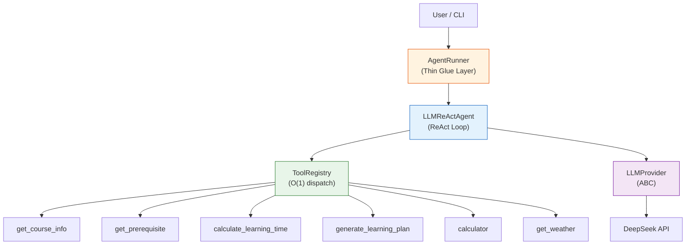
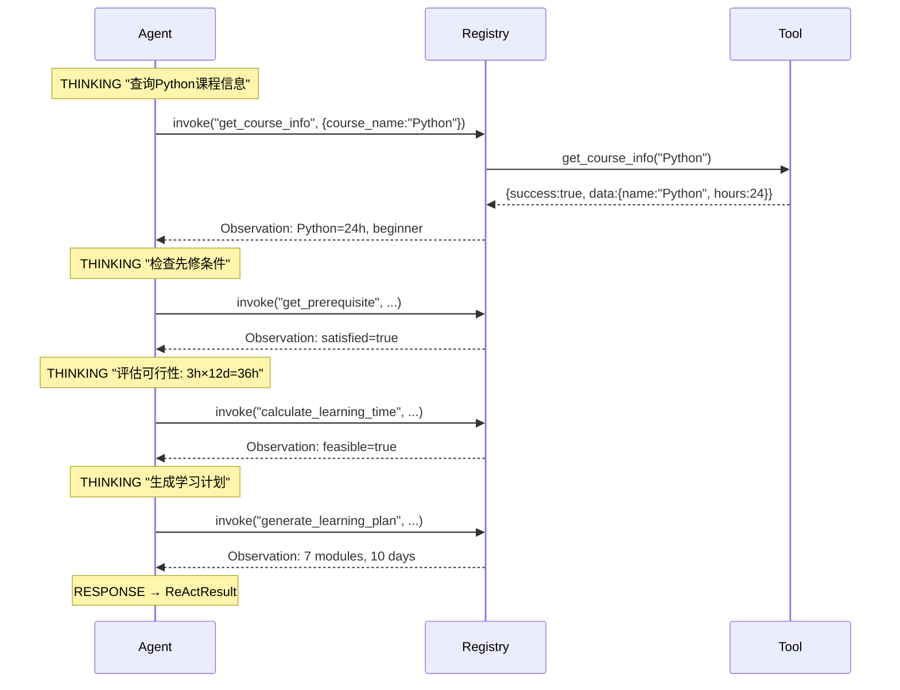
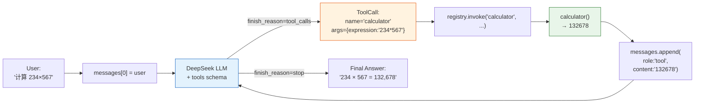
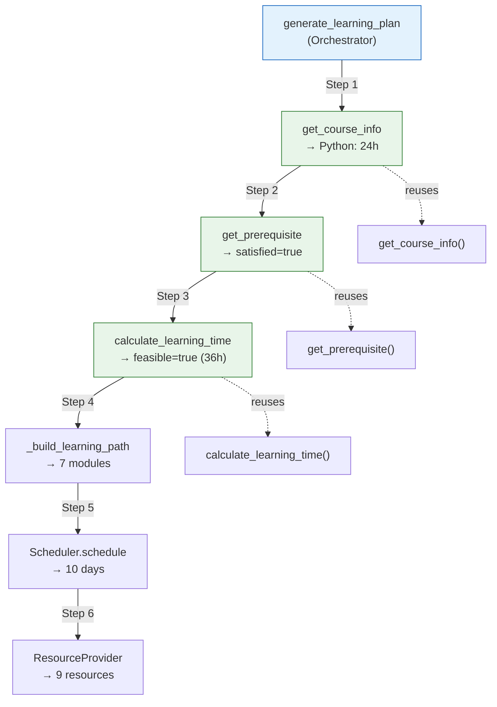

# Defense Storyboard — Course Learning Planner Agent

| Field | Value |
|-------|-------|
| Duration | 10 minutes |
| Slides | 10 |
| Style | Technical conference (AI Engineer / System Design) |
| Audience | AI engineering professor / technical interviewer |

---

## Slide 1: "This is an Agent, not a Chatbot"

**Time:** 0:00-1:00
**Type:** Problem → Solution

### Assertion

> A Chatbot guesses. An Agent calls tools.

### Visual

```
┌────────────────────────────┬────────────────────────────────┐
│         CHATBOT            │           THIS AGENT           │
├────────────────────────────┼────────────────────────────────┤
│                            │                                │
│  User: "学Python要多久?"    │  User: "学Python要多久?"        │
│                            │                                │
│  Bot: "大约2-3个月"        │  Agent:                        │
│       ↑ 编造的!            │    Thought: 查询课程信息         │
│                            │    Action: get_course_info      │
│                            │    Observation: Python = 24h    │
│                            │    Answer: "24小时, 7个模块"    │
│                            │         ↑ 来自Tool, 可验证      │
└────────────────────────────┴────────────────────────────────┘
```

### Code evidence

```python
# src/tools/course_info.py
def get_course_info(course_name: str) -> dict:
    courses = load_courses()               # ← 从JSON加载, 非模型记忆
    for course in courses:
        if course.name.lower() == query:
            return {"success": True, "data": course.model_dump()}
    return {"success": False, "error": {...}}
```

### Speaker notes

> "传统Chatbot的回答来自模型训练数据——它会告诉你'大约2-3个月'。这个Agent的回答来自Tool调用——`get_course_info('Python')` 返回 `24小时, 7个模块`。每个数字都有数据来源, 每步决策都有Trace记录。"

---

## Slide 2: "Four Layers, Zero Circular Imports"

**Time:** 1:00-2:00
**Type:** System Architecture

### Assertion

> Architecture is layered and dependency direction is strict.

### Visual — Mermaid



### Key numbers

```
26 source files | 3,707 lines | 4 layers | 0 circular imports
162 tests | ~90% coverage | 10 Pydantic models | 8 exception types
```

### Speaker notes

> "四层架构: Provider → Agent → Tools → Models。依赖方向严格向下, 零循环导入。AgentRunner是薄胶水层, LLMReActAgent是核心循环, ToolRegistry是O(1)调度, LLMProvider是抽象基类。26个源文件, 3707行, 架构清晰。"

---

## Slide 3: "Every Action is Recorded in a 13-step Trace"

**Time:** 2:00-3:00
**Type:** Execution Demo

### Assertion

> The ReAct loop produces a complete, auditable execution trail.

### Visual — Sequence Diagram



### Code evidence

```python
# Real trace output from demo.py
Trace (13 steps):
  Step  1 | THINKING          | 查询'Python'课程信息...
  Step  2 | TOOL_EXECUTION    | [get_course_info] (2ms)
  Step  3 | OBSERVATION       | data_keys: [id,name,hours,...]
  Step  4 | THINKING          | 检查先修条件
  Step  5 | TOOL_EXECUTION    | [get_prerequisite] (6ms)
  ... (13 steps total)
```

### Speaker notes

> "ReAct循环产生13步执行Trace。每步记录: 状态(THINKING/EXECUTION/OBSERVATION), 调用的Tool, 输入参数, 输出摘要, 时间戳, 耗时。这不仅用于调试——这是Agent的审计日志。"

---

## Slide 4: "O(1) Dispatch. Zero if/elif."

**Time:** 3:00-4:00
**Type:** Code Design

### Assertion

> ToolRegistry uses a dict, not a switch statement.

### Visual — Code Comparison

```
❌ ANTI-PATTERN (if/elif chain):          ✅ Registry Pattern (dict):
                                           ┌──────────────────────┐
def invoke(name, **kwargs):               │ ToolRegistry         │
    if name == "get_course_info":         │                      │
        return get_course_info(**kwargs)  │  _tools = {          │
    elif name == "get_prerequisite":      │    "get_course_info" │
        return get_prereq(**kwargs)       │      → ToolEntry(),  │
    elif name == "calculate_time":        │    "calculator"      │
        return calc_time(**kwargs)        │      → ToolEntry(),  │
    ...  ← 每加一个Tool要改这里!           │    ...               │
                                          │  }                   │
                                          │                      │
                                          │  def invoke(name,**kw)│
                                          │    e = self._tools   │
                                          │         .get(name)   │
                                          │    return e.function( │
                                          │         **kw)        │
                                          └──────────────────────┘
```

### Code evidence

```python
# src/agent/tool_registry.py
class ToolRegistry:
    def __init__(self):
        self._tools: dict[str, ToolEntry] = {}   # ← O(1)

    def invoke(self, name: str, **kwargs) -> dict:
        entry = self._tools.get(name)            # ← dict lookup
        if entry is None:
            return TOOL_NOT_FOUND error
        return entry.function(**kwargs)          # ← direct call

# Adding a new tool:
registry.register(ToolEntry(
    name="calculator",
    function=calculator,         # ← just register it
    input_schema={...},
))
# Agent code: 0 lines changed
```

### Speaker notes

> "关键设计: Registry用的是dict, 不是if/elif链。O(1)调度。加一个新Tool——比如calculator——只需`registry.register(ToolEntry(...))`, Agent代码一行不改。这就是Registry Pattern的价值。"

---

## Slide 5: "Agent Never Touches an SDK"

**Time:** 4:00-5:00
**Type:** Abstraction Design

### Assertion

> LLMProvider ABC shields the Agent from vendor lock-in.

### Visual — Class Hierarchy

```
┌─────────────────────────────────────────────┐
│              LLMProvider (ABC)              │
│  ┌───────────────────────────────────────┐  │
│  │ @abstractmethod                       │  │
│  │ def chat(messages, tools) → LLMResponse│  │
│  └───────────────────────────────────────┘  │
└──────────────┬──────────────────────────────┘
               │
    ┌──────────┼──────────┐
    ▼          ▼          ▼
┌────────┐ ┌────────┐ ┌────────┐
│DeepSeek│ │ OpenAI │ │ Claude │
│Provider│ │Provider│ │Provider│
└───┬────┘ └────────┘ └────────┘
    │
    │  OpenAI(base_url="https://api.deepseek.com")
    ▼
┌─────────────┐
│ DeepSeek API │
└─────────────┘
```

### Code evidence

```python
# src/providers/base.py — Agent only imports THIS
class LLMProvider(ABC):
    @abstractmethod
    def chat(self, messages, tools) -> LLMResponse: ...

# src/providers/deepseek_provider.py — Provider handles SDK
class DeepSeekProvider(LLMProvider):
    def chat(self, messages, tools) -> LLMResponse:
        try:
            response = self._client.chat.completions.create(...)
        except AuthenticationError:  # ← 5 exception types mapped
            raise ProviderError("API Key 无效")
        return self._parse_response(response)

# Agent code — zero openai/ anthropic imports
agent = LLMReActAgent(registry, provider)
```

### Speaker notes

> "Agent代码从不import openai或anthropic。它只依赖`LLMProvider(ABC)`。DeepSeekProvider内部使用OpenAI SDK——因为DeepSeek API完全兼容。换Claude? 只需实现`ClaudeProvider(LLMProvider)`, Agent零改动。这就是抽象的力量。"

---

## Slide 6: "LLM Decides. Agent Executes."

**Time:** 5:00-6:00
**Type:** Data Flow

### Assertion

> The LLM decides WHICH tool to call. The Agent executes it.

### Visual — Data Flow



### Code evidence

```python
# src/agent/llm_react.py — the core loop
for _ in range(MAX_TOOL_ROUNDS):
    response = self.provider.chat(messages, tools_schema)

    if not response.tool_calls:          # ← LLM says "done"
        return ReActResult(data={"answer": response.content})

    for tc in response.tool_calls:       # ← LLM wants tools
        result = registry.invoke(tc.name, **tc.arguments)
        messages.append({"role": "tool", "content": json.dumps(result)})
```

### Speaker notes

> "关键: LLM决定调用哪个Tool, Agent负责执行。LLM返回tool_calls→Agent通过Registry调用→结果追加到对话→LLM继续推理→直到LLM说stop。Agent不做推理决策, LLM不直接执行代码。职责清晰分离。"

---

## Slide 7: "4 Tools, 1 Orchestrator, Zero Code Duplication"

**Time:** 6:00-7:00
**Type:** Workflow Demo

### Assertion

> The orchestrator reuses tools. It never reimplements them.

### Visual — Workflow



### Real output (from demo.py)

```
[课程] Python
[模块] 7 个 (6必修 + 1可选)
[天数] 10 天 (8学习 + 1复习 + 1评估)
[资源] 9 条
[Trace] 13 步
```

### Speaker notes

> "generate_learning_plan是编排器, 不是又一个Tool。Step 1-3直接调用已有的get_course_info/get_prerequisite/calculate_learning_time——零代码重复。Step 4-6是编排器独有的: 构建学习路径、调度每日计划、收集资源。Scheduler是独立的贪心打包算法, ResourceProvider用Provider模式为未来RAG预留接口。"

---

## Slide 8: "Fail Fast, Fail Safe"

**Time:** 7:00-8:00
**Type:** Reliability

### Assertion

> The agent stops early, never wastes computation, and never crashes silently.

### Visual — Exception Decision Tree

```
get_prerequisite("Spark", user_knowledge=[])
    │
    ▼
satisfied? ──NO──▶ PREREQUISITE_CONFLICT (Terminal)
    │                 ├─ missing: [Python, Hadoop, Linux, Java]
    │                 ├─ total: 112h
    │                 └─ STOP. Do NOT call calculate_learning_time.
    │
   YES
    │
    ▼
calculate_learning_time("Flink", 1, 10)
    │
    ▼
feasible? ──NO──▶ TIME_INSUFFICIENT (Terminal)
                     ├─ deficit: 26h
                     ├─ Option A: extend to 36 days
                     ├─ Option B: increase to 3.6h/day
                     ├─ Option C: reduce to 31h (required only)
                     └─ STOP. Do NOT call generate_learning_plan.
```

### Code evidence

```python
# DAG-aware recursive expansion
if name_lower in visited:
    return  # ← shared dependency, NOT a cycle error

# Depth safety
MAX_RECURSION_DEPTH = 5

# 8 exception types
class PrerequisiteConflictError(CourseLearningError): ...
class TimeInsufficientError(CourseLearningError): ...
class CircularDependencyError(CourseLearningError): ...
```

### Speaker notes

> "两个阻断点: 先修不满足→立即终止, 不浪费后续Tool调用。时间不足→终止并输出3种调整方案。DAG感知: 共享依赖(Java被Flink和Hadoop同时引用)不会误判为循环。8种异常类型, 每种有明确的error_code。"

---

## Slide 9: "Every Decision is Auditable"

**Time:** 8:00-9:00
**Type:** Observability

### Assertion

> Trace is not a log. It's the agent's decision record.

### Visual — Trace Structure

```
┌─────────────────────────────────────────────────────────┐
│ TraceEntry (8 fields per step)                          │
├──────────┬──────────────┬──────────┬───────────────────┤
│ step: 1  │ state:       │ thought: │ selected_tool:    │
│          │ "THINKING"   │ "查询    │ null              │
│          │              │ Python   │                   │
│          │              │ 课程"    │                   │
├──────────┼──────────────┼──────────┼───────────────────┤
│ step: 2  │ state:       │ thought: │ selected_tool:    │
│          │ "TOOL_EXEC"  │ null     │ "get_course_info" │
│          │              │          │ tool_input: {...}  │
├──────────┼──────────────┼──────────┼───────────────────┤
│ step: 3  │ state:       │ thought: │ tool_output:      │
│          │ "OBSERVATION"│ null     │ {success:true,    │
│          │              │          │  data_keys:[...]} │
├──────────┴──────────────┴──────────┴───────────────────┤
│ timestamp: 2026-07-11T15:30:00.123Z                    │
│ elapsed_ms: 2                                          │
└─────────────────────────────────────────────────────────┘
```

### Trace patterns

```
Success:       13 steps (4 THINKING + 4 EXEC + 4 OBS + 1 RESP)
Prereq Conflict: 7 steps (stops after get_prerequisite)
Time Insufficient: 10 steps (stops after calculate_learning_time)
```

### Speaker notes

> "Trace不只是日志——它是Agent的决策记录。13步成功路径, 7步阻断路径。每步记录: 状态、思考内容、选择的Tool、输入参数、输出摘要、时间戳、耗时。答辩时你可以指着任意一步说: '这里Agent决定调用get_prerequisite, 因为上一步get_course_info返回了Spark的先修课列表'。"

---

## Slide 10: "What's Next: Memory, RAG, Multi-Agent"

**Time:** 9:00-10:00
**Type:** Summary & Future

### Assertion

> The architecture is designed for extension, not just demonstration.

### Visual — Extension Roadmap

```
┌──────────┬──────────────┬──────────────┬──────────────┐
│   MVP    │    v1.1      │    v1.2      │    v2.0      │
│  (now)   │              │              │              │
├──────────┼──────────────┼──────────────┼──────────────┤
│ ReAct    │ + Memory     │ + RAG        │ + Multi-Agent│
│ FSM/LLM  │  多轮对话     │  资源检索     │  协作规划     │
│          │              │              │              │
│ 4 Tools  │ + Progress   │ + Web UI     │ + Evaluation │
│          │  学习追踪     │  FastAPI     │  Agent评估    │
│          │              │              │              │
│ DeepSeek │ + Claude     │ + OpenAI     │ + Local LLM  │
│          │  Provider    │  Provider    │  Ollama      │
└──────────┴──────────────┴──────────────┴──────────────┘
```

### 3 Core Takeaways

```
1. Agent ≠ Chatbot
   └─ Tool output > Model memory

2. Architecture = Extensible
   └─ New Tool: 0 Agent changes | New Provider: 0 Agent changes

3. Engineering = Reliable
   └─ 162 tests | 90% coverage | 8 exceptions | full trace
```

### Speaker notes

> "当前MVP展示了Agent的三个核心能力: Tool Calling、动态推理、多步编排。架构为扩展而设计: v1.1加Memory支持多轮对话, v1.2加RAG做智能资源检索, v2.0演进为Multi-Agent协作。Provider抽象让DeepSeek可以无缝替换为Claude或OpenAI。162个测试, 90%覆盖率, 8种异常类型, 完整的Trace审计——这不是一个demo, 这是一个有工程质量的Agent系统。"

---

## Slide Timing Summary

| Slide | Title | Time | Type |
|-------|-------|------|------|
| 1 | "This is an Agent, not a Chatbot" | 0-1m | Problem |
| 2 | "Four Layers, Zero Circular Imports" | 1-2m | Architecture |
| 3 | "Every Action is Recorded in a 13-step Trace" | 2-3m | Execution |
| 4 | "O(1) Dispatch. Zero if/elif." | 3-4m | Design |
| 5 | "Agent Never Touches an SDK" | 4-5m | Abstraction |
| 6 | "LLM Decides. Agent Executes." | 5-6m | Data Flow |
| 7 | "4 Tools, 1 Orchestrator, Zero Duplication" | 6-7m | Workflow |
| 8 | "Fail Fast, Fail Safe" | 7-8m | Reliability |
| 9 | "Every Decision is Auditable" | 8-9m | Observability |
| 10 | "What's Next" | 9-10m | Future |
