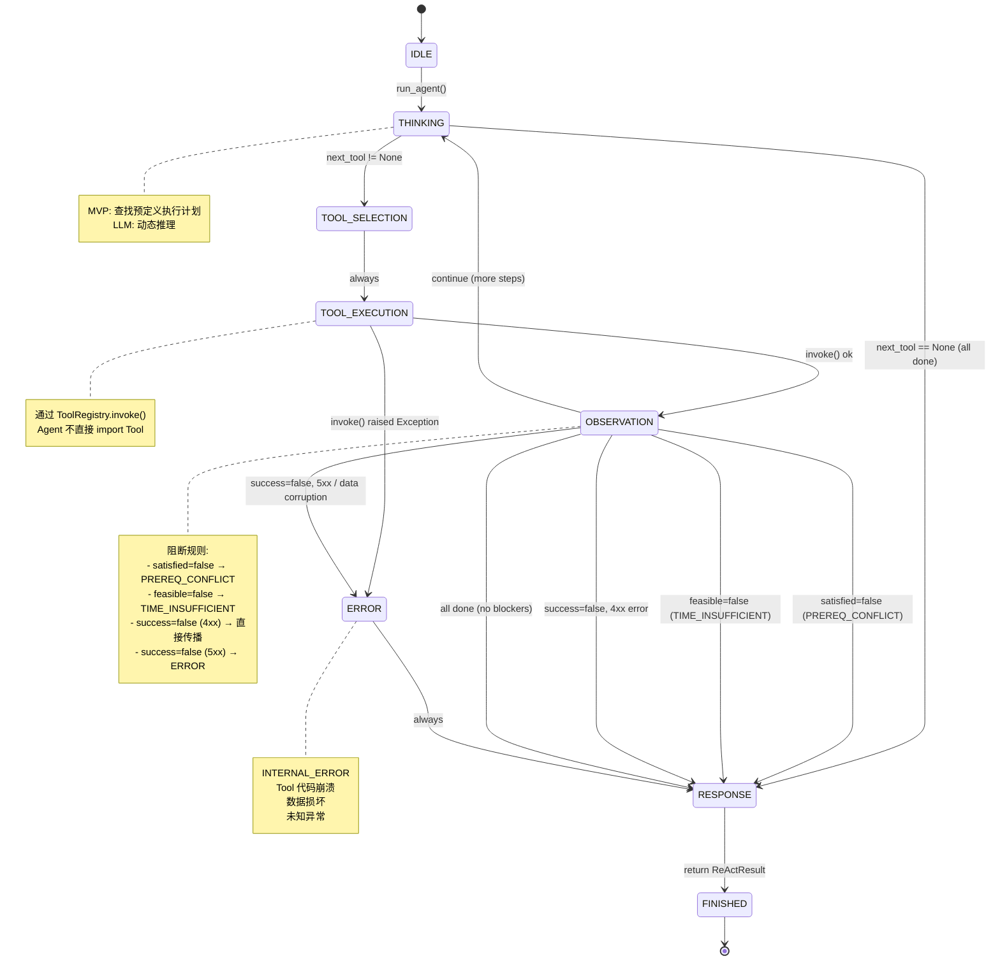

# ReAct FSM Design — Task 3.2

| Field | Value |
|-------|-------|
| Version | 1.0.0 |
| Created | 2026-07-11 |
| Status | Draft — awaiting confirmation |
| Parent Doc | `docs/agent-core-design.md` |

---

## 1. State 定义

### 1.1 状态枚举

```
IDLE → THINKING → TOOL_SELECTION → TOOL_EXECUTION → OBSERVATION → RESPONSE → FINISHED
                      ↑                                      │
                      │         ┌────────────────────────────┘
                      │         ▼
                      └── (blocker detected → RESPONSE)
                                    │
                              ERROR ┘
```

### 1.2 每个 State 的详细定义

#### IDLE

| 属性 | 值 |
|------|-----|
| **描述** | Agent 初始化完成，等待用户输入。`run_agent()` 被调用后立即离开。 |
| **输入** | 无 |
| **输出** | 无（直接转换到 THINKING） |
| **进入条件** | Agent 实例化，`run()` 方法被调用 |
| **退出条件** | 无条件 → THINKING |
| **MVP 行为** | 加载 System Prompt，初始化空的 ReActState，初始化 trace 列表 |

#### THINKING

| 属性 | 值 |
|------|-----|
| **描述** | Agent 分析当前状态，决定下一步需要调用哪个 Tool。 |
| **输入** | `ReActState`（累积的上下文: course_info, prereq_result, feasibility 等） |
| **输出** | `thought: str`（推理文本）, `next_tool: str \| None`（下一步 Tool 名称或 None） |
| **进入条件** | 从 IDLE 或 OBSERVATION（继续循环）进入 |
| **退出条件** | `next_tool` 非空 → TOOL_SELECTION |
| **退出条件** | `next_tool` 为 None → RESPONSE（所有步骤完成） |
| **MVP 行为** | 按固定的执行计划查找下一个未执行的 Tool 名称。不依赖 LLM。 |

#### TOOL_SELECTION

| 属性 | 值 |
|------|-----|
| **描述** | 根据 THINKING 的结果，选择 Tool 并构建参数。 |
| **输入** | `next_tool: str`, `ReActState`（用于构建 Tool 参数） |
| **输出** | `selected_tool: str`, `tool_params: dict` |
| **进入条件** | 从 THINKING 进入（next_tool 非空） |
| **退出条件** | 无条件 → TOOL_EXECUTION |
| **MVP 行为** | 调用 `_build_params(tool_name, state)` 从 ReActState 提取参数。 |

#### TOOL_EXECUTION

| 属性 | 值 |
|------|-----|
| **描述** | 通过 ToolRegistry 执行选定的 Tool。 |
| **输入** | `selected_tool: str`, `tool_params: dict`, `ToolRegistry` |
| **输出** | `tool_result: dict`（Tool 的原始返回） |
| **进入条件** | 从 TOOL_SELECTION 进入 |
| **退出条件** | Tool 执行成功 → OBSERVATION |
| **退出条件** | Tool 代码抛出未捕获异常 → ERROR |
| **MVP 行为** | `self.registry.invoke(tool_name, **params)` |

#### OBSERVATION

| 属性 | 值 |
|------|-----|
| **描述** | 分析 Tool 返回结果。判断是否有阻断条件（先修冲突/时间不足/错误）。更新执行上下文。 |
| **输入** | `tool_result: dict` |
| **输出** | 更新后的 `ReActState`（累积 data）或触发异常分支 |
| **进入条件** | 从 TOOL_EXECUTION 进入 |
| **退出条件** | `tool_result["success"]=false` → ERROR 或对应 Terminal State |
| **退出条件** | `tool_result["data"]["satisfied"]=false` → PREREQ_CONFLICT (立即→RESPONSE) |
| **退出条件** | `tool_result["data"]["feasible"]=false` → TIME_INSUFFICIENT (立即→RESPONSE) |
| **退出条件** | 所有步骤完成 → RESPONSE |
| **退出条件** | 还有步骤未完成 → THINKING（继续循环） |
| **MVP 行为** | 检查 `result["success"]`、`satisfied`、`feasible` 字段，判断分支。 |

#### RESPONSE

| 属性 | 值 |
|------|-----|
| **描述** | 组装最终输出。成功时组装学习计划，失败时组装错误响应。 |
| **输入** | `ReActState`（所有累积数据）, `trace: list[TraceEntry]` |
| **输出** | `ReActResult(success, data/error, trace)` |
| **进入条件** | 从 OBSERVATION（所有步骤完成或阻断条件触发）或 ERROR 进入 |
| **退出条件** | 无条件 → FINISHED |
| **MVP 行为** | 如果是阻断 → 组装 error dict。如果是成功 → 组装 plan dict。 |

#### ERROR

| 属性 | 值 |
|------|-----|
| **描述** | Tool 执行失败或返回意外数据时进入。非 4xx 业务错误的兜底。 |
| **输入** | `exception: Exception \| None`, `tool_result: dict \| None` |
| **输出** | `error_info: dict`（INTERNAL_ERROR 或其他） |
| **进入条件** | TOOL_EXECUTION 异常 或 OBSERVATION 发现 5xx 级错误 |
| **退出条件** | 无条件 → RESPONSE |
| **MVP 行为** | 包装异常信息，设置 `code="INTERNAL_ERROR"`。 |

#### FINISHED

| 属性 | 值 |
|------|-----|
| **描述** | 终端状态。将 ReActResult 返回给调用方（runner.py）。 |
| **输入** | `ReActResult` |
| **输出** | `ReActResult`（返回给 runner） |
| **进入条件** | 从 RESPONSE 进入 |
| **退出条件** | 无（循环结束） |

---

## 2. 每个 State 的输入/输出/退出条件（汇总表）

| State | 输入 | 输出 | 退出条件 |
|-------|------|------|---------|
| **IDLE** | — | — | → THINKING (always) |
| **THINKING** | ReActState | thought, next_tool | next_tool有值→TOOL_SELECTION; 无值→RESPONSE |
| **TOOL_SELECTION** | next_tool, ReActState | selected_tool, tool_params | → TOOL_EXECUTION (always) |
| **TOOL_EXECUTION** | selected_tool, tool_params, ToolRegistry | tool_result | 成功→OBSERVATION; 异常→ERROR |
| **OBSERVATION** | tool_result | updated ReActState | satisfied=false→PREREQ_CONFLICT; feasible=false→TIME_INSUFFICIENT; success=false→ERROR; 完成→RESPONSE; 否则→THINKING |
| **RESPONSE** | ReActState, trace | ReActResult | → FINISHED (always) |
| **ERROR** | exception, tool_result | error_info | → RESPONSE (always) |
| **FINISHED** | ReActResult | ReActResult (returned) | — (terminal) |

---

## 3. State Transition Table

| From | Condition | To | Action |
|------|-----------|----|--------|
| IDLE | run() called | THINKING | 初始化 ReActState + trace |
| THINKING | next_tool != None | TOOL_SELECTION | 记录 thought 到 trace |
| THINKING | next_tool == None | RESPONSE | 所有步骤完成 |
| TOOL_SELECTION | — | TOOL_EXECUTION | 构建 params，记录 selected_tool 到 trace |
| TOOL_EXECUTION | invoke() 成功返回 dict | OBSERVATION | 记录 tool_result 到 trace |
| TOOL_EXECUTION | invoke() 抛出 Exception | ERROR | 捕获异常 |
| OBSERVATION | success=true, satisfied=true, feasible=true, 还有步骤未完成 | THINKING | 更新 ReActState |
| OBSERVATION | success=true, satisfied=false | RESPONSE | error_type="prerequisites_conflict" |
| OBSERVATION | success=true, feasible=false | RESPONSE | error_type="time_insufficient" |
| OBSERVATION | success=false (4xx) | RESPONSE | error_type=error_code |
| OBSERVATION | success=false (5xx) | ERROR | 数据损坏或内部错误 |
| OBSERVATION | 所有步骤完成，无阻断 | RESPONSE | 组装 ReActResult(success=true) |
| ERROR | — | RESPONSE | 包装 INTERNAL_ERROR |
| RESPONSE | — | FINISHED | 返回 ReActResult |
| FINISHED | — | — | Terminal |

---

## 4. Mermaid 状态图



---

## 5. ReAct Trace 数据结构

### 5.1 TraceEntry

```python
@dataclass
class TraceEntry:
    step: int                    # 步骤序号 (1-based)
    state: str                   # Agent FSM 状态 (THINKING/TOOL_EXECUTION/OBSERVATION/...)
    thought: str | None          # 推理文本（THINKING 状态时有值）
    selected_tool: str | None    # 选择的 Tool 名称（TOOL_SELECTION 状态时有值）
    tool_input: dict | None      # Tool 输入参数（TOOL_EXECUTION 状态时有值）
    tool_output: dict | None     # Tool 输出（OBSERVATION 状态时有值，可能被截断以控制大小）
    timestamp: str               # ISO 8601 毫秒时间戳
    elapsed_ms: int              # 本步骤耗时（毫秒）
```

### 5.2 示例 Trace

**成功路径（4 步）:**

```python
[
    TraceEntry(step=1, state="THINKING", thought="查询Python课程信息",
               selected_tool=None, tool_input=None, tool_output=None, ...),
    TraceEntry(step=2, state="TOOL_EXECUTION", thought=None,
               selected_tool="get_course_info",
               tool_input={"course_name": "Python"},
               tool_output=None, ...),
    TraceEntry(step=3, state="OBSERVATION", thought=None,
               selected_tool=None, tool_input=None,
               tool_output={"success": True, "data": {"name": "Python", "hours": 24, ...}},
               ...),
    TraceEntry(step=4, state="THINKING", thought="先修满足，评估可行性", ...),
    # ... 继续
    TraceEntry(step=12, state="RESPONSE", thought=None, selected_tool=None,
               tool_input=None, tool_output=None, ...),
]
```

**阻断路径（先修冲突）:**

```python
[
    TraceEntry(step=1, state="THINKING", thought="查询Spark课程", ...),
    TraceEntry(step=2, state="TOOL_EXECUTION", selected_tool="get_course_info", ...),
    TraceEntry(step=3, state="OBSERVATION", tool_output={"success": True, ...}, ...),
    TraceEntry(step=4, state="THINKING", thought="检查先修条件", ...),
    TraceEntry(step=5, state="TOOL_EXECUTION", selected_tool="get_prerequisite", ...),
    TraceEntry(step=6, state="OBSERVATION",
               tool_output={"success": True, "data": {"satisfied": False, "missing": [...], ...}},
               ...),
    TraceEntry(step=7, state="RESPONSE", thought="先修不满足→终止", ...),
]
```

---

## 6. Rule-based Tool Selection（MVP → LLM 迁移路径）

### 6.1 MVP: 预定义执行计划

```python
# MVP 的 Tool Selection 逻辑：一个固定的执行计划列表
EXECUTION_PLAN = [
    ToolStep(
        tool_name="get_course_info",
        thought_template="查询'{course_name}'课程信息，获取学时和先修要求。",
        params_builder=lambda state: {"course_name": state.course_name},
        blocker_check=None,  # 不检查阻断（只传播 error）
    ),
    ToolStep(
        tool_name="get_prerequisite",
        thought_template="检查用户是否满足'{course_name}'的先修条件。",
        params_builder=lambda state: {
            "course_name": state.course_name,
            "user_knowledge": state.user_knowledge,
        },
        blocker_check=lambda result: (
            "PREREQ_CONFLICT" if result["data"]["satisfied"] is False else None
        ),
    ),
    ToolStep(
        tool_name="calculate_learning_time",
        thought_template="评估时间可行性: {daily_hours}h/天 × {duration_days}天。",
        params_builder=lambda state: {
            "course_name": state.course_name,
            "daily_hours": state.daily_hours,
            "duration_days": state.duration_days,
        },
        blocker_check=lambda result: (
            "TIME_INSUFFICIENT" if result["data"]["feasible"] is False else None
        ),
    ),
    ToolStep(
        tool_name="generate_learning_plan",
        thought_template="生成完整学习计划。",
        params_builder=lambda state: {
            "course_name": state.course_name,
            "daily_hours": state.daily_hours,
            "duration_days": state.duration_days,
            "user_knowledge": state.user_knowledge,
        },
        blocker_check=None,  # 最后一步，无阻断
    ),
]
```

**每个 ToolStep 包含:**
- `tool_name`: 要调用的 Tool 名称
- `thought_template`: THINKING 状态时注入的推理文本（MVP 使用 f-string 格式化）
- `params_builder`: 从 ReActState 提取参数的函数
- `blocker_check`: 检查 Tool 返回结果是否触发阻断的函数（返回 error_type 或 None）

### 6.2 执行逻辑

```python
def run(self, course_name, daily_hours, duration_days, user_knowledge=None):
    state = ReActState(course_name, daily_hours, duration_days, user_knowledge)
    trace = []

    for step_def in self.EXECUTION_PLAN:
        # THINKING
        trace.append(TraceEntry(state="THINKING", thought=step_def.format_thought(state)))

        # TOOL_SELECTION
        params = step_def.params_builder(state)
        trace.append(TraceEntry(state="TOOL_SELECTION", selected_tool=step_def.tool_name))

        # TOOL_EXECUTION
        result = self.registry.invoke(step_def.tool_name, **params)
        trace.append(TraceEntry(state="TOOL_EXECUTION", tool_input=params))

        # OBSERVATION
        trace.append(TraceEntry(state="OBSERVATION", tool_output=_summarize(result)))

        if not result["success"]:
            return self._build_error(result, trace)  # → RESPONSE

        # 检查阻断条件
        blocker = step_def.blocker_check(result) if step_def.blocker_check else None
        if blocker == "PREREQ_CONFLICT":
            return self._build_prereq_error(result, trace)  # → RESPONSE
        if blocker == "TIME_INSUFFICIENT":
            return self._build_time_error(result, trace)   # → RESPONSE

        state.update(result["data"])  # 更新上下文

    # → RESPONSE (success)
    return self._build_success(state, trace)
```

### 6.3 LLM 迁移路径

```
MVP (Rule-based)                          LLM (Future)
─────────────────                         ─────────────
EXECUTION_PLAN (硬编码列表)       →       LLM 动态推理

for step_def in PLAN:             →       while not llm.decides_done():
    result = invoke(tool=fixed)               thought = llm.reason(context, tool_schemas)
                                              tool = llm.select_tool(thought)
                                              result = invoke(tool=dynamic)
                                              context.append(result)
                                              if blocker_check(result):
                                                  break

替换点: 仅需覆写 _reason() 和 _select_tool() 两个方法。
ToolRegistry、Tool、Prompt Loader 完全不变。
```

| 组件 | MVP 实现 | LLM 实现 | 替换方式 |
|------|---------|---------|---------|
| `_reason()` | 查找 `EXECUTION_PLAN` 中当前步骤的 `thought_template` | 调用 LLM API，传入 System Prompt + Context | 子类覆写 |
| `_select_tool()` | 查找 `EXECUTION_PLAN` 中当前步骤的 `tool_name` | LLM 返回 function_call JSON | 子类覆写 |
| `_build_params()` | 调用 `step_def.params_builder(state)` | 从 LLM function_call 提取参数 | 子类覆写 |
| `_check_blocker()` | 调用 `step_def.blocker_check(result)` | LLM 自行判断 Tool 返回 | 子类覆写 |
| `registry.invoke()` | 不变 | 不变 | 无需替换 |
| Tool 函数 | 不变 | 不变 | 无需替换 |

---

## 附录: 代码结构规划

```python
# src/agent/react_loop.py

@dataclass
class ReActState:
    """累积的 Agent 执行上下文。"""
    course_name: str
    daily_hours: float
    duration_days: int
    user_knowledge: list[str]
    course_data: dict | None = None
    prereq_result: dict | None = None
    feasibility_result: dict | None = None
    plan_data: dict | None = None

@dataclass
class TraceEntry:
    """单条 Trace 记录。"""
    step: int
    state: str
    thought: str | None = None
    selected_tool: str | None = None
    tool_input: dict | None = None
    tool_output: dict | None = None
    timestamp: str = field(default_factory=lambda: datetime.now(timezone.utc).isoformat())
    elapsed_ms: int = 0

@dataclass
class ReActResult:
    """Agent 最终输出。"""
    success: bool
    data: dict | None = None
    error: dict | None = None
    trace: list[TraceEntry] = field(default_factory=list)

class RuleBasedReActAgent:
    """MVP: 规则化 ReAct 状态机。"""
    EXECUTION_PLAN: list[ToolStep] = [...]  # 4 步预定义计划

    def __init__(self, registry: ToolRegistry): ...
    def run(self, ...) -> ReActResult: ...
    def _build_success(self, state, trace) -> ReActResult: ...
    def _build_error(self, result, trace) -> ReActResult: ...
```
