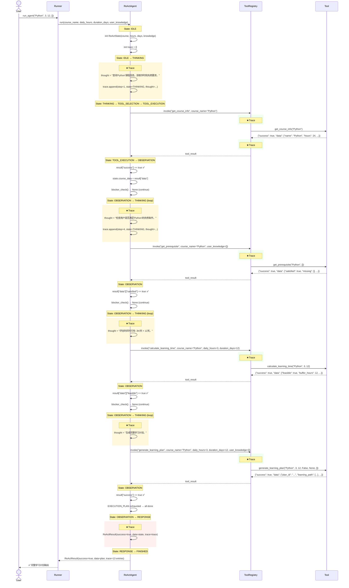
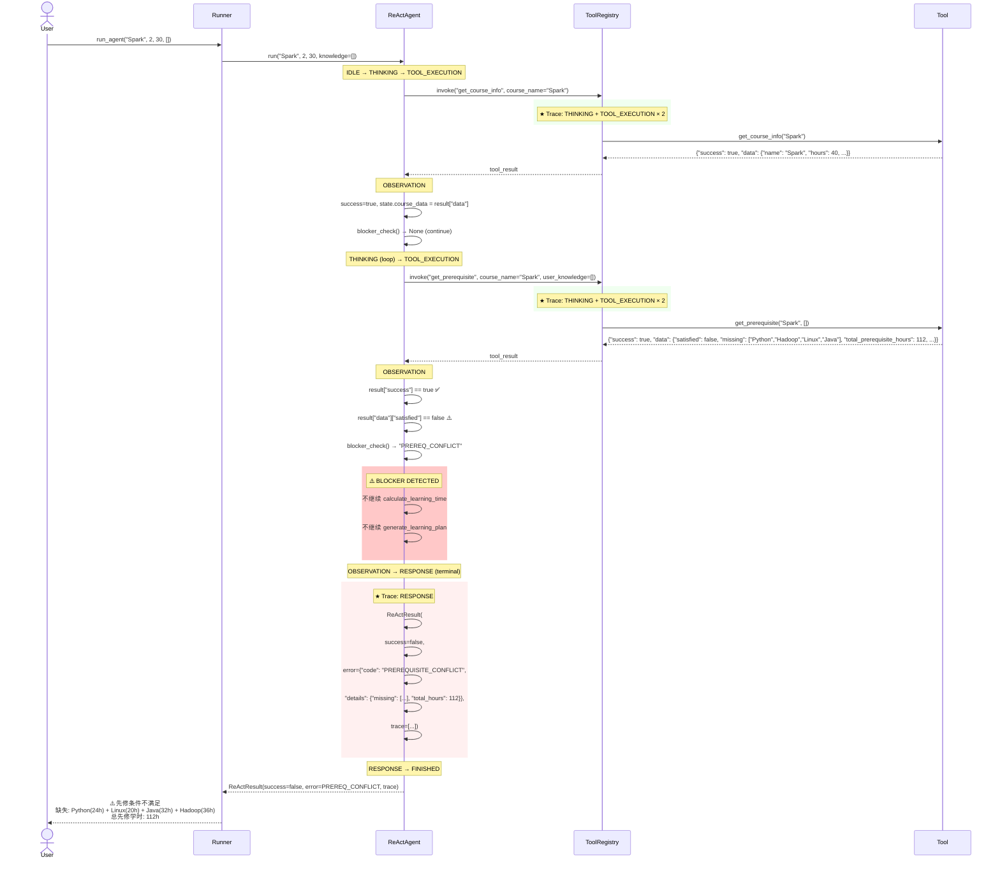
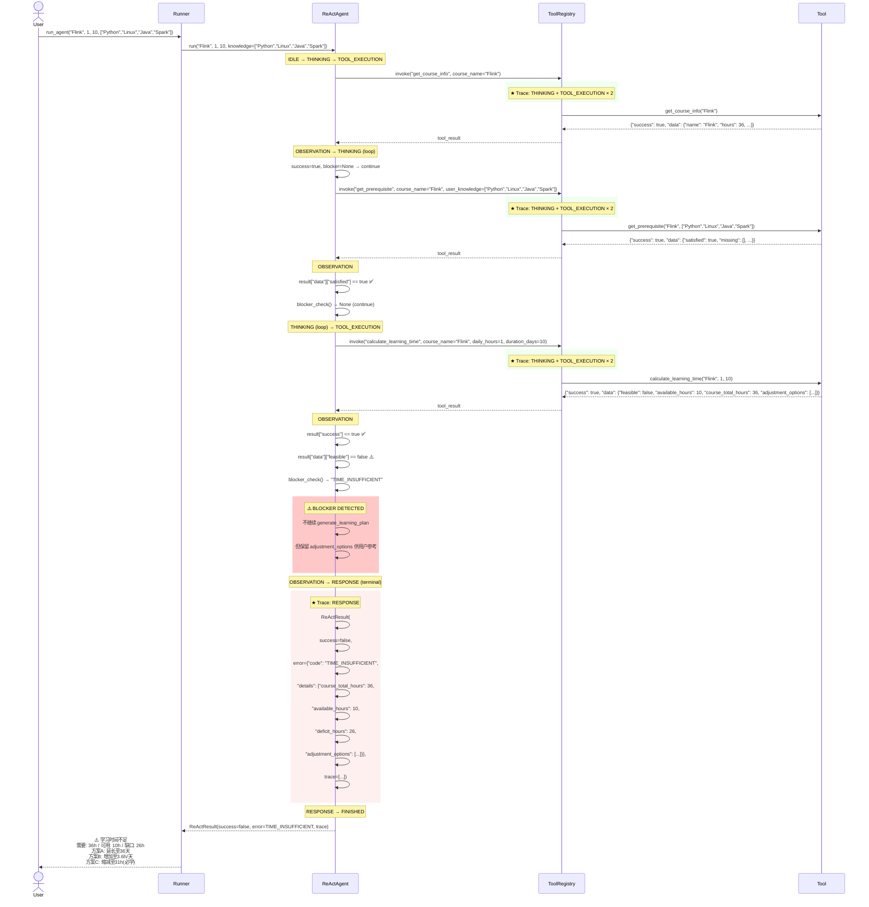

# ReAct Sequence Diagrams — Task 3.2

| Field | Value |
|-------|-------|
| Version | 1.0.0 |
| Created | 2026-07-11 |
| Parent | `docs/react-fsm-design.md` |

---

## 1. Sequence Diagram: 成功流程



---

## 2. Sequence Diagram: PREREQUISITE_CONFLICT 失败流程



---

## 3. Sequence Diagram: TIME_INSUFFICIENT 失败流程



---

## 4. Trace 记录位置汇总

| Trace # | 状态 | 记录内容 | FSM 阶段 |
|---------|------|---------|---------|
| 1 | THINKING | `thought` = 推理文本 | THINKING 开始 |
| 2 | TOOL_EXECUTION | `selected_tool` + `tool_input` | TOOL_SELECTION → TOOL_EXECUTION |
| 3 | TOOL_EXECUTION | `tool_output` = Tool 返回结果 | TOOL_EXECUTION 返回 |
| 4 | THINKING | `thought` = 推理文本（下一轮） | THINKING 开始（循环） |
| ... | ... | ... | ... |
| N | RESPONSE | 无 tool 信息 | RESPONSE 组装完成 |

**Trace 在 3 个时机记录:**

```
1. THINKING 开始时 → 记录 thought
2. TOOL_EXECUTION 开始前 → 记录 selected_tool + tool_input
3. OBSERVATION 进入时 → 记录 tool_output

Trace 在 3 种路径结束:
1. 成功: 所有 ToolStep 完成 → RESPONSE → FINISHED
2. 4xx 阻断: blocker_check 触发 → RESPONSE(terminal) → FINISHED
3. 异常: Tool 抛异常 → ERROR → RESPONSE → FINISHED
```

**成功路径 Trace 数量:**
- 4 个 Tool × 3 条记录 + 1 条 RESPONSE = **13 条 Trace**
- 包含: 4 THINKING + 4 TOOL_EXECUTION(input) + 4 OBSERVATION(output) + 1 RESPONSE

**阻断路径 Trace 数量（以先修冲突为例）:**
- 2 个 Tool 完成 × 3 条 + 1 条 RESPONSE = **7 条 Trace**
- 包含: 2 THINKING + 2 TOOL_EXECUTION(input) + 2 OBSERVATION(output) + 1 RESPONSE
