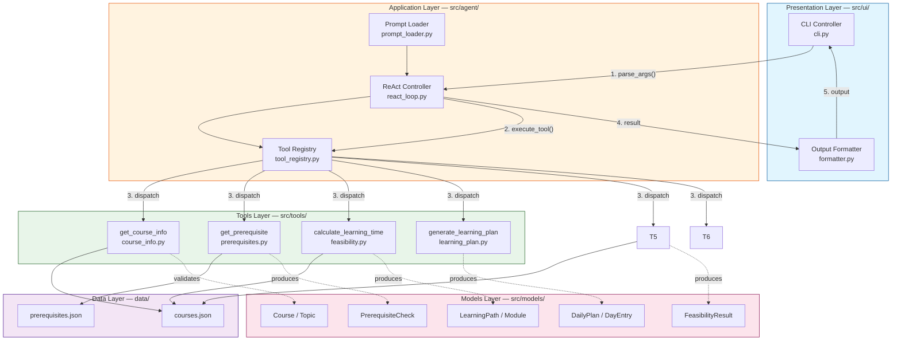
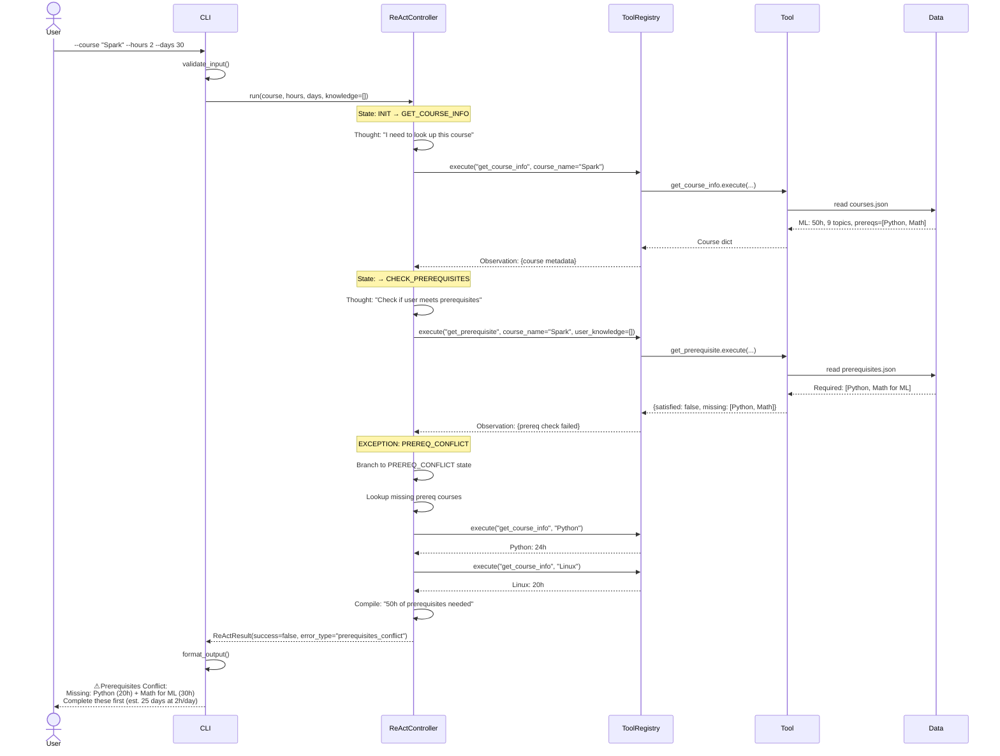
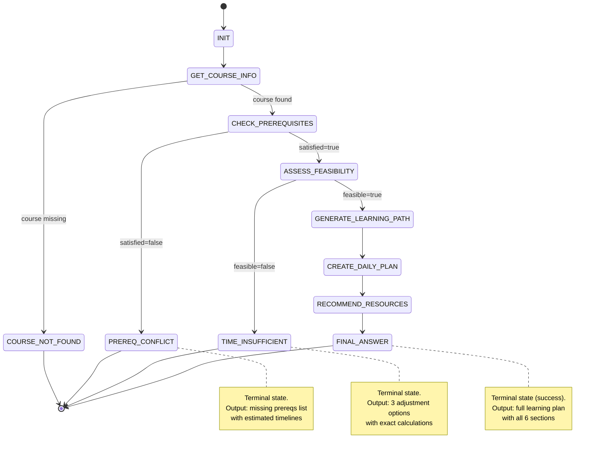
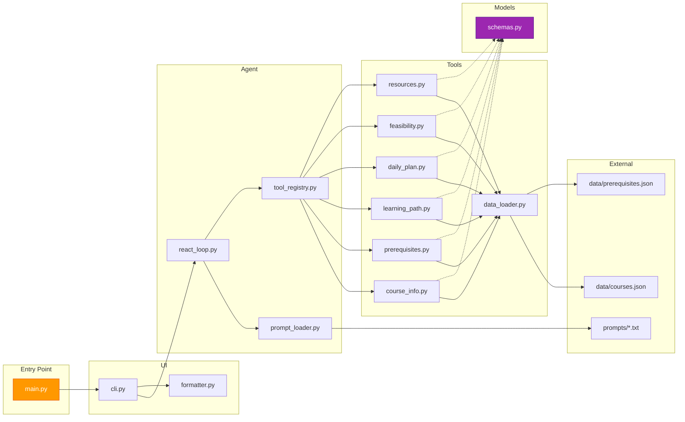

# System Design — Course Learning Planner Agent

| Field | Value |
|-------|-------|
| Version | 1.0.0 |
| Created | 2026-07-11 |
| Status | Draft — MVP Architecture |
| Skill | system-design-basics |

---

## Table of Contents

1. [Project Architecture](#1-project-architecture)
2. [Agent Workflow](#2-agent-workflow)
3. [Tool Calling Flow](#3-tool-calling-flow)
4. [Data Flow](#4-data-flow)
5. [Mermaid Architecture Diagrams](#5-mermaid-architecture-diagrams)
6. [Module Division](#6-module-division)
7. [Future Extension Plans](#7-future-extension-plans)

---

## 1. Project Architecture

### 1.1 Design Philosophy

The system follows three core architectural principles drawn from production-grade system design patterns:

| Principle | Application |
|-----------|-------------|
| **Separation of Concerns** | Each layer (UI → Agent → Tools → Data) has a single, well-defined responsibility. No layer crosses into another's domain. |
| **Stateless Core** | The ReAct agent maintains no session state internally. All state is passed explicitly through the execution context, enabling horizontal scaling and easy testing. |
| **Pluggable Tool Architecture** | Tools are registered via a registry pattern. Adding a new tool requires zero changes to the agent core — just implement and register. |

### 1.2 Layered Architecture

```
┌──────────────────────────────────────────────────────────────────┐
│                     PRESENTATION LAYER                            │
│  src/ui/                                                          │
│  ┌──────────────┐  ┌─────────────────┐  ┌────────────────────┐   │
│  │   cli.py     │  │  formatter.py   │  │  (future: web ui)  │   │
│  │  argparse    │  │  text/json/csv  │  │                    │   │
│  └──────┬───────┘  └────────┬────────┘  └────────────────────┘   │
│         │                   │                                      │
├─────────┼───────────────────┼──────────────────────────────────────┤
│         ▼                   ▼                                      │
│                     APPLICATION LAYER                              │
│  src/agent/                                                        │
│  ┌──────────────────────────────────────────────────────────────┐ │
│  │                    ReActController                            │ │
│  │  ┌────────────┐  ┌────────────┐  ┌──────────────────────┐   │ │
│  │  │  Prompt    │  │  State     │  │  Exception Handler   │   │ │
│  │  │  Loader    │  │  Machine   │  │  ┌────────────────┐  │   │ │
│  │  │            │  │  (FSM)     │  │  │ Prereq Conflict│  │   │ │
│  │  └────────────┘  └─────┬──────┘  │  │ Time Deficit   │  │   │ │
│  │                        │         │  └────────────────┘  │   │ │
│  │                  ┌─────▼──────┐  │                       │   │ │
│  │                  │   Tool     │  │                       │   │ │
│  │                  │  Registry  │  │                       │   │ │
│  │                  └─────┬──────┘  │                       │   │ │
│  └────────────────────────┼─────────────────────────────────┘   │
│                           │                                       │
├───────────────────────────┼───────────────────────────────────────┤
│                           ▼                                       │
│                      TOOLS LAYER                                  │
│  src/tools/                                                        │
│  ┌──────────┐ ┌──────────┐ ┌──────────┐ ┌──────────┐            │
│  │get_course│ │check_    │ │generate_ │ │create_   │            │
│  │_info     │ │prereqs   │ │learning_ │ │daily_    │            │
│  │          │ │          │ │path      │ │plan      │            │
│  └────┬─────┘ └────┬─────┘ └────┬─────┘ └────┬─────┘            │
│       │            │            │            │                   │
│  ┌────┴─────┐ ┌────┴────────────┴─────┐                          │
│  │learning_ │ │  learning_plan       │                          │
│  │  time    │ │  (orchestrator)      │                          │
│  │feasibility│ │                       │                          │
│  └────┬─────┘ └───────────┬───────────┘                          │
│       │                   │                                       │
├───────┼───────────────────┼───────────────────────────────────────┤
│       ▼                   ▼                                       │
│                      DATA LAYER                                   │
│  src/models/          data/                                       │
│  ┌──────────────┐  ┌──────────────┐  ┌──────────────┐            │
│  │  Pydantic    │  │  courses.    │  │  prerequisites│           │
│  │  Schemas     │  │  json        │  │  .json        │            │
│  └──────────────┘  └──────────────┘  └──────────────┘            │
│                                                                   │
└──────────────────────────────────────────────────────────────────┘
```

### 1.3 Cross-Cutting Concerns

| Concern | Implementation | Layer |
|---------|---------------|-------|
| **Logging** | Structured step trace (Thought/Action/Observation) | Application |
| **Error Handling** | Exception hierarchy with user-facing messages | All layers |
| **Validation** | Pydantic models at boundaries; argparse at CLI | Data + UI |
| **Observability** | ReAct trace log (every step recorded) | Application |

### 1.4 Design Trade-offs

| Decision | Alternative | Why Chosen |
|----------|-------------|------------|
| Rule-based FSM for MVP | Real LLM (GPT/Claude) | Zero API dependency, deterministic, easy to test; LLM swap is designed in |
| JSON file data store | SQLite / PostgreSQL | Zero setup, human-readable, sufficient for ~10 courses |
| Synchronous execution | Async tool calls | Simpler debugging, no concurrency bugs for MVP |
| argparse CLI | Web UI (FastAPI/Gradio) | Zero dependencies, instant startup, easy demo |
| Monolithic Python package | Microservices | MVP scope; modular internal design allows future split |

---

## 2. Agent Workflow

### 2.1 ReAct Pattern — Formal Definition

The agent implements the **ReAct (Reasoning + Acting)** paradigm, a structured approach where the agent alternates between reasoning steps and tool-calling actions:

```
┌─────────────────────────────────────────────────────────────┐
│                     REACT LOOP LIFECYCLE                     │
│                                                              │
│  ┌──────────┐                                                │
│  │  START   │                                                │
│  └────┬─────┘                                                │
│       ▼                                                      │
│  ┌──────────────────────────────────────────────────────┐   │
│  │              REASONING PHASE                          │   │
│  │  ┌────────────────────────────────────────────────┐  │   │
│  │  │ Evaluate current state:                          │  │   │
│  │  │  - What do I know so far?                        │  │   │
│  │  │  - What do I still need to know?                 │  │   │
│  │  │  - What tool provides that information?          │  │   │
│  │  │  - Is there a blocking condition?                │  │   │
│  │  └────────────────────┬───────────────────────────┘  │   │
│  └───────────────────────┼──────────────────────────────┘   │
│                          ▼                                    │
│  ┌──────────────────────────────────────────────────────┐   │
│  │              ACTING PHASE                             │   │
│  │  ┌────────────────────────────────────────────────┐  │   │
│  │  │ 1. Select tool from registry                     │  │   │
│  │  │ 2. Build parameters from state context           │  │   │
│  │  │ 3. Execute tool call                             │  │   │
│  │  │ 4. Receive result (or error)                     │  │   │
│  │  └────────────────────┬───────────────────────────┘  │   │
│  └───────────────────────┼──────────────────────────────┘   │
│                          ▼                                    │
│  ┌──────────────────────────────────────────────────────┐   │
│  │              OBSERVATION PHASE                        │   │
│  │  ┌────────────────────────────────────────────────┐  │   │
│  │  │ 1. Validate tool result                          │  │   │
│  │  │ 2. Update state with new information             │  │   │
│  │  │ 3. Check exception conditions:                   │  │   │
│  │  │    - Prerequisites missing? → BRANCH             │  │   │
│  │  │    - Time insufficient? → BRANCH                 │  │   │
│  │  │ 4. Decide: continue loop or produce final answer │  │   │
│  │  └────────────────────┬───────────────────────────┘  │   │
│  └───────────────────────┼──────────────────────────────┘   │
│                          │                                    │
│                    ┌─────▼──────┐                             │
│                    │  Complete?  │                             │
│                    └──┬──────┬──┘                             │
│                   NO  │      │  YES                           │
│                       │      └────────┐                       │
│                       ▼               ▼                       │
│                  (back to        ┌──────────┐                 │
│                   REASONING)     │  FINAL   │                 │
│                                  │  ANSWER  │                 │
│                                  └──────────┘                 │
└─────────────────────────────────────────────────────────────┘
```

### 2.2 State Machine Definition

The MVP implements the ReAct loop as a deterministic **Finite State Machine (FSM)** with 8 states:

```
                    ┌──────────┐
                    │   INIT   │
                    └────┬─────┘
                         │
                         ▼
                ┌─────────────────┐
                │ GET_COURSE_INFO │
                └───────┬─────────┘
                        │
              ┌─────────┴─────────┐
              │ course found?     │
              └────────┬──────────┘
                 YES   │   NO
                       │
           ┌───────────┘
           ▼
   ┌──────────────────┐        ┌───────────────────┐
   │ GET_PREREQUISITE │        │ COURSE_NOT_FOUND  │
   └────────┬─────────┘        │ (Terminal State)  │
            │                  └───────────────────┘
       ┌────┴────┐
       │satisfied│
       └────┬────┘
      YES   │   NO
            │
   ┌────────┘
   ▼
┌─────────────────────────┐   ┌───────────────────┐
│ CALCULATE_LEARNING_TIME │   │ PREREQ_CONFLICT   │
└───────────┬─────────────┘   │ (Terminal State)  │
            │                 └───────────────────┘
       ┌────┴────┐
       │feasible?│
       └────┬────┘
      YES   │   NO
            │
   ┌────────┘
   ▼
┌──────────────────────────┐  ┌───────────────────┐
│ GENERATE_LEARNING_PLAN   │  │ TIME_INSUFFICIENT │
│ (orchestrator: path +    │  │ (Terminal State)  │
│  daily schedule +        │  └───────────────────┘
│  resources)              │
└───────────┬──────────────┘
            │
            ▼
     ┌──────────────────┐
     │   FINAL_ANSWER   │
     │ (Terminal State) │
     └──────────────────┘
```

### 2.3 State Transition Table

| Current State | Condition | Next State | Action |
|---------------|-----------|------------|--------|
| INIT | — | GET_COURSE_INFO | Load system prompt |
| GET_COURSE_INFO | course found | GET_PREREQUISITE | Store course data in context |
| GET_COURSE_INFO | course not found | COURSE_NOT_FOUND | Set error result, list available courses |
| GET_PREREQUISITE | satisfied=true | CALCULATE_LEARNING_TIME | Store prereq result |
| GET_PREREQUISITE | satisfied=false | PREREQ_CONFLICT | Generate missing prereq plan |
| CALCULATE_LEARNING_TIME | feasible=true | GENERATE_LEARNING_PLAN | Store feasibility data |
| CALCULATE_LEARNING_TIME | feasible=false | TIME_INSUFFICIENT | Calculate 3 adjustment options |
| GENERATE_LEARNING_PLAN | — | FINAL_ANSWER | Build path + daily plan + resources |

### 2.4 Exception Branching Logic

```
                        ┌──────────────────┐
                        │ GET_PREREQUISITE │
                        └────────┬─────────┘
                                 │
                        ┌────────┴────────┐
                        │  satisfied?     │
                        └────────┬────────┘
                           YES   │   NO
                                 │
                                 ▼
                        ┌─────────────────────┐
                        │  PREREQ_CONFLICT    │
                        │                     │
                        │  Actions:           │
                        │  1. List missing    │
                        │  2. Lookup each     │
                        │     missing course  │
                        │  3. Calculate total │
                        │     prereq hours    │
                        │  4. Build prereq    │
                        │     study plan      │
                        │  5. Return error    │
                        │     with guidance   │
                        └─────────────────────┘


                        ┌──────────────────────────┐
                        │  CALCULATE_LEARNING_TIME│
                        └───────────┬──────────────┘
                                   │
                          ┌────────┴────────┐
                          │  feasible?      │
                          └────────┬────────┘
                             YES   │   NO
                                   │
                                   ▼
                        ┌─────────────────────────────┐
                        │  TIME_INSUFFICIENT           │
                        │                              │
                        │  Calculate 3 Options:        │
                        │                              │
                        │  Option A: Extend Duration   │
                        │  ┌────────────────────────┐  │
                        │  │ new_days = ceil(        │  │
                        │  │   total_hours /         │  │
                        │  │   daily_hours)          │  │
                        │  └────────────────────────┘  │
                        │                              │
                        │  Option B: Increase Hours    │
                        │  ┌────────────────────────┐  │
                        │  │ new_hours = ceil(        │  │
                        │  │   total_hours /         │  │
                        │  │   duration_days)        │  │
                        │  └────────────────────────┘  │
                        │                              │
                        │  Option C: Reduce Scope      │
                        │  ┌────────────────────────┐  │
                        │  │ Re-run with             │  │
                        │  │ skip_optional=True      │  │
                        │  │ Compare reduced hours   │  │
                        │  └────────────────────────┘  │
                        │                              │
                        │  Present all 3 to user       │
                        └─────────────────────────────┘
```

### 2.5 Reliability Patterns Applied

| Pattern | Implementation |
|---------|---------------|
| **Circuit Breaker** | If a tool returns an error, the state machine transitions to a terminal state instead of retrying indefinitely |
| **Graceful Degradation** | If `generate_learning_plan` encounters a resource error internally, the final answer still includes the learning path and daily plan (resources are optional) |
| **Timeout Enforcement** | Each tool call has an implicit boundary — the rule-based FSM completes or transitions within one step |
| **Input Validation** | All user inputs validated at the CLI boundary BEFORE entering the agent loop |

---

## 3. Tool Calling Flow

### 3.1 Tool Lifecycle

```
┌─────────────────────────────────────────────────────────────────┐
│                     TOOL CALLING LIFECYCLE                       │
│                                                                  │
│  ┌──────────┐                                                   │
│  │  AGENT   │                                                   │
│  │  DECIDES │ "I need course information"                       │
│  │  TO CALL │                                                   │
│  └────┬─────┘                                                   │
│       │                                                          │
│       ▼                                                          │
│  ┌──────────────────────────────────────────────────────────┐   │
│  │ 1. TOOL SELECTION                                         │   │
│  │    registry.get("get_course_info")                        │   │
│  │    → Returns: Callable tool function                      │   │
│  └────────────────────┬─────────────────────────────────────┘   │
│                       ▼                                          │
│  ┌──────────────────────────────────────────────────────────┐   │
│  │ 2. PARAMETER RESOLUTION                                    │   │
│  │    param_resolver(context) → {"course_name": "Python"}    │   │
│  │    Context contains: user input + all prior observations  │   │
│  └────────────────────┬─────────────────────────────────────┘   │
│                       ▼                                          │
│  ┌──────────────────────────────────────────────────────────┐   │
│  │ 3. INPUT VALIDATION                                        │   │
│  │    Pydantic model validates parameters                    │   │
│  │    Invalid → return error dict, skip tool execution       │   │
│  └────────────────────┬─────────────────────────────────────┘   │
│                       ▼                                          │
│  ┌──────────────────────────────────────────────────────────┐   │
│  │ 4. TOOL EXECUTION                                          │   │
│  │    tool.execute(**validated_params)                        │   │
│  │    - Read from data layer                                 │   │
│  │    - Process / compute                                    │   │
│  │    - Return result dict                                   │   │
│  └────────────────────┬─────────────────────────────────────┘   │
│                       ▼                                          │
│  ┌──────────────────────────────────────────────────────────┐   │
│  │ 5. RESULT PROCESSING                                       │   │
│  │    - Validate output against expected schema              │   │
│  │    - Check for error conditions                           │   │
│  │    - Store in agent context (ReActState)                  │   │
│  │    - Log as Observation                                   │   │
│  └────────────────────┬─────────────────────────────────────┘   │
│                       ▼                                          │
│  ┌──────────────────────────────────────────────────────────┐   │
│  │ 6. NEXT STEP DETERMINATION                                 │   │
│  │    - Success → advance to next FSM state                  │   │
│  │    - Exception condition → branch to error state          │   │
│  │    - Error → transition to terminal state                 │   │
│  └──────────────────────────────────────────────────────────┘   │
│                                                                  │
└─────────────────────────────────────────────────────────────────┘
```

### 3.2 Tool Registry Pattern

```
┌────────────────────────────────────────────────────┐
│                 TOOL REGISTRY                       │
│                                                    │
│  ┌──────────────────────────────────────────────┐ │
│  │           Registration (startup)              │ │
│  │                                              │ │
│  │  registry.register("get_course_info",        │ │
│  │                     get_course_info_tool)     │ │
│  │  registry.register("get_prerequisite",    │ │
│  │                     check_prereqs_tool)       │ │
│  │  ... (all 6 tools)                           │ │
│  └────────────────────┬─────────────────────────┘ │
│                       │                            │
│                       ▼                            │
│  ┌──────────────────────────────────────────────┐ │
│  │           Dispatch (runtime)                  │ │
│  │                                              │ │
│  │  def execute(name, **kwargs):                │ │
│  │      tool = self._tools.get(name)            │ │
│  │      if not tool:                            │ │
│  │          return {"error": "Unknown tool"}    │ │
│  │      return tool.execute(**kwargs)           │ │
│  └──────────────────────────────────────────────┘ │
│                                                    │
│  Provides:                                         │
│  ┌────────────────────────────────────────────┐   │
│  │ • Name → Callable mapping                   │   │
│  │ • Schema export (for LLM function calling)  │   │
│  │ • Tool discovery / listing                  │   │
│  │ • Lazy registration support                 │   │
│  └────────────────────────────────────────────┘   │
└────────────────────────────────────────────────────┘
```

### 3.3 Tool Call Sequence (Happy Path)

```
Time ──────────────────────────────────────────────────────────▶

Agent      Tool Registry     get_course_info    get_prereq     calc_learning_time  generate_learning_plan
  │              │                  │                 │                  │               │              │
  │──get()──────▶│                  │                 │                  │               │              │
  │              │──execute()──────▶│                 │                  │               │              │
  │              │                  │──read JSON─────▶│                  │               │              │
  │              │                  │◀───Course───────│                  │               │              │
  │              │◀──result─────────│                 │                  │               │              │
  │◀──Observation│                  │                 │                  │               │              │
  │              │                  │                 │                  │               │              │
  │──get()──────▶│                  │                 │                  │               │              │
  │              │──execute()─────────────────────────▶│                  │               │              │
  │              │                  │                 │──compare()──────▶│               │              │
  │              │                  │                 │◀──PrereqResult───│               │              │
  │              │◀──result────────────────────────────│                  │               │              │
  │◀──Observation│                  │                 │                  │               │              │
  │              │                  │                 │                  │               │              │
  │──get()──────▶│                  │                 │                  │               │              │
  │              │──execute()───────────────────────────────────────────▶│               │              │
  │              │                  │                 │                  │──compute()────▶│              │
  │              │                  │                 │                  │◀──Feasibility──│              │
  │              │◀──result──────────────────────────────────────────────│               │              │
  │◀──Observation│                  │                 │                  │               │              │
  │              │                  │                 │                  │               │              │
  │──get()──────▶│                  │                 │                  │               │              │
  │              │──execute()──────────────────────────────────────────────────────────▶│              │
  │              │                  │                 │                  │               │──topics─────▶│
  │              │                  │                 │                  │               │◀──Path───────│
  │              │◀──result─────────────────────────────────────────────────────────────│              │
  │◀──Observation│                  │                 │                  │               │              │
  │              │                  │                 │                  │               │              │
  │──get()──────▶│                  │                 │                  │               │              │
  │              │──execute()─────────────────────────────────────────────────────────────────────────▶│
  │              │                  │                 │                  │               │              │──schedule()──▶
  │              │                  │                 │                  │               │              │◀──DailyPlan───
  │              │◀──result────────────────────────────────────────────────────────────────────────────│
  │◀──Observation│                  │                 │                  │               │              │
  │              │                  │                 │                  │               │              │
  │──Final Answer (compiles all observations into structured output)                                  │
```

### 3.4 Tool Failure Handling

```
┌──────────────────────────────────────────────────────────────┐
│                   TOOL FAILURE DECISION TREE                  │
│                                                               │
│  Tool returns result                                          │
│       │                                                       │
│       ▼                                                       │
│  ┌─────────────┐                                              │
│  │ Has "error" │──YES──▶ Is it recoverable?                   │
│  │ key?        │           │                                   │
│  └──────┬──────┘      ┌────┴────┐                              │
│         NO            │ YES     │ NO                           │
│         │             │         │                              │
│         ▼             ▼         ▼                              │
│  ┌──────────────┐ ┌────────┐ ┌──────────┐                     │
│  │ Process      │ │Retry   │ │Stop,     │                     │
│  │ result       │ │or use  │ │return    │                     │
│  │ normally     │ │default │ │error to  │                     │
│  └──────────────┘ └────────┘ │user      │                     │
│                              └──────────┘                     │
│                                                               │
│  Error Categories:                                            │
│  ┌──────────────────┬──────────┬───────────────────────────┐ │
│  │ Error            │ Example  │ Handling                   │ │
│  ├──────────────────┼──────────┼───────────────────────────┤ │
│  │ NOT_FOUND        │ Course   │ Terminal: list available   │ │
│  │                  │ missing  │ courses, ask retry         │ │
│  ├──────────────────┼──────────┼───────────────────────────┤ │
│  │ VALIDATION_ERROR │ Bad args │ Terminal: fix input        │ │
│  ├──────────────────┼──────────┼───────────────────────────┤ │
│  │ DATA_ERROR       │ JSON     │ Terminal: report issue     │ │
│  │                  │ corrupt  │                           │ │
│  ├──────────────────┼──────────┼───────────────────────────┤ │
│  │ BUSINESS_RULE    │ Prereqs  │ Branch: present guidance   │ │
│  │                  │ missing  │                           │ │
│  └──────────────────┴──────────┴───────────────────────────┘ │
└──────────────────────────────────────────────────────────────┘
```

---

## 4. Data Flow

### 4.1 End-to-End Data Transformation Pipeline

```
┌─────────────────────────────────────────────────────────────────────────────┐
│                         DATA FLOW PIPELINE                                    │
│                                                                              │
│  RAW INPUT              VALIDATED INPUT           ENRICHED CONTEXT           │
│  ┌──────────┐           ┌──────────────┐          ┌──────────────────┐      │
│  │ "Python  │           │ CourseName:  │          │ course: Course{} │      │
│  │  Progr..."│──step1──▶│ "Python      │──step2──▶│ prereqs: {}      │      │
│  │ 2 hours  │  PARSE    │ Programming" │  TOOL    │ feasibility: {}  │      │
│  │ 30 days  │           │ Hours: 2.0   │  CALLS   │ path: Path{}     │      │
│  │ []       │           │ Days: 30     │          │ plan: Plan{}     │      │
│  └──────────┘           │ Knowledge:[] │          │ resources: []    │      │
│                         └──────────────┘          └────────┬─────────┘      │
│                                                           │                 │
│                                                           ▼                 │
│  FORMATTED OUTPUT        STRUCTURED RESULT                                   │
│  ┌──────────────┐       ┌──────────────────┐                                │
│  │ ## Learning  │       │ {                │                                │
│  │    Plan      │◀──────│   "success":true,│                                │
│  │              │step4  │   "result":{     │                                │
│  │ ### Course.. │FORMAT │     "overview":{},│                               │
│  │ ### Path...  │       │     "path":{},   │                                │
│  │ ### Daily... │       │     "plan":{},   │                                │
│  └──────────────┘       │   },             │                                │
│                         │   "trace":[...]  │                                │
│                         │ }                │                                │
│                         └──────────────────┘                                │
│                                    │                                         │
│                          ┌─────────▼──────────┐                             │
│                          │    REACT TRACE      │                             │
│                          │  [                  │                             │
│                          │   {thought,action,  │                             │
│                          │    observation},    │                             │
│                          │   {thought,action,  │                             │
│                          │    observation},    │                             │
│                          │   ...               │                             │
│                          │  ]                  │                             │
│                          └────────────────────┘                             │
└─────────────────────────────────────────────────────────────────────────────┘
```

### 4.2 Data Transformation Stages

```
STAGE 1: INPUT PARSING
═══════════════════════════════════════════════════════════
CLI args ──────────▶ InputModel (Pydantic)

  "Python" ──▶ CourseName("Python")
  2                     ──▶ DailyHours(2.0)      [validated 0.5..16]
  30                    ──▶ DurationDays(30)      [validated 1..365]
  ""                    ──▶ UserKnowledge([])     [default empty]

  Validated by: src/ui/cli.py → argparse + parse_args()
  Schema:       src/models/ (InputValidation models)

STAGE 2: CONTEXT ENRICHMENT (ReAct Loop)
═══════════════════════════════════════════════════════════
Each tool call adds to the ReActState:

  State after Tool 1 (get_course_info):
  ┌────────────────────────────────────────────┐
  │ course: Course{                            │
  │   name: "Python",                          │
  │   total_hours: 20,                         │
  │   difficulty: "beginner",                  │
  │   topics: [...5 topics],                   │
  │   prerequisites: []                        │
  │ }                                          │
  └────────────────────────────────────────────┘

  State after Tool 2 (get_prerequisite):
  ┌────────────────────────────────────────────┐
  │ prereq_result: PrerequisiteCheck{          │
  │   satisfied: true,                         │
  │   missing: [],                             │
  │   required: []                             │
  │ }                                          │
  └────────────────────────────────────────────┘

  State after Tool 3 (calculate_learning_time):
  ┌────────────────────────────────────────────┐
  │ feasibility: FeasibilityResult{            │
  │   feasible: true,                          │
  │   available_hours: 60,  (2×30)             │
  │   needed_hours: 20,                        │
  │   buffer_hours: 40                         │
  │ }                                          │
  └────────────────────────────────────────────┘

  State after Tool 4 (generate_learning_plan):
  ┌────────────────────────────────────────────┐
  │ learning_path: LearningPath{               │
  │   modules: [Module×5],                     │
  │   total_hours: 20                          │
  │ }                                          │
  └────────────────────────────────────────────┘

  State after Tool 4 (generate_learning_plan — includes path + schedule + resources):
  ┌────────────────────────────────────────────┐
  │ daily_plan: DailyPlan{                     │
  │   days: [DayEntry×10],                     │
  │   includes_review_days: true               │
  │ }                                          │
  └────────────────────────────────────────────┘

STAGE 3: RESULT COMPILATION
═══════════════════════════════════════════════════════════
ReActState ──────────▶ ReActResult

  The result object contains:
  - success: bool
  - course_overview: dict (from Tool 1)
  - prereq_check: dict (from Tool 2)
  - feasibility: dict (from Tool 3)
  - learning_path: dict (from Tool 4) — null if blocked
  - daily_plan: dict (from Tool 5) — null if blocked
  - resources: list[dict] (from Tool 6) — null if blocked
  - error_type: str | None (prerequisites_conflict | time_insufficient)
  - error_details: dict | None
  - trace: list[ReActStep] (full reasoning trail)

STAGE 4: OUTPUT FORMATTING
═══════════════════════════════════════════════════════════
ReActResult ──────────▶ Console Output

  Format modes:
  ┌──────────────┬───────────────────────────────┐
  │ Mode         │ Output                        │
  ├──────────────┼───────────────────────────────┤
  │ text (default)│ Formatted sections with       │
  │              │ headers and simple tables      │
  ├──────────────┼───────────────────────────────┤
  │ json         │ Valid JSON string              │
  │              │ (for programmatic consumption) │
  ├──────────────┼───────────────────────────────┤
  │ verbose      │ Text mode + full ReAct trace   │
  └──────────────┴───────────────────────────────┘
```

### 4.3 Data Storage Schema

```
data/
├── courses.json                  # Course catalog
│   └── courses[]:
│       ├── name: str             # Primary lookup key
│       ├── description: str      # One-paragraph overview
│       ├── difficulty: enum      # beginner|intermediate|advanced
│       ├── estimated_total_hours: float
│       ├── prerequisites: [str]  # Foreign keys → other course names
│       └── topics[]:
│           ├── name: str
│           ├── hours: float
│           ├── order: int        # 1-based sequencing
│           └── required: bool    # Can be skipped if time is tight
│
└── prerequisites.json            # Prerequisite dependency graph
    └── prerequisite_map: dict[str, PrereqEntry]
        └── key: course_name
            ├── required: [str]   # Must complete before
            └── recommended: [str] # Strongly suggested
```

---

## 5. Mermaid Architecture Diagrams

### 5.1 System Component Architecture



### 5.2 ReAct Loop Sequence Diagram



### 5.3 Exception Handling State Machine



### 5.4 Module Dependency Graph



---

## 6. Module Division

### 6.1 Module Responsibility Matrix

| Module | Path | Responsibility | Dependencies | Exports |
|--------|------|---------------|--------------|---------|
| **CLI** | `src/ui/cli.py` | Parse CLI args, invoke agent, print output | agent.runner, ui.formatter | `main()` |
| **Formatter** | `src/ui/formatter.py` | Format ReActResult as text or JSON | models | `format_output()` |
| **ReAct Loop** | `src/agent/react_loop.py` | FSM-based ReAct execution, state management, exception branching | agent.prompt_loader, agent.tool_registry, models | `ReActController`, `ReActState`, `ReActResult` |
| **Prompt Loader** | `src/agent/prompt_loader.py` | Load and format system prompt + ReAct template from disk | None | `load_system_prompt()`, `load_react_template()` |
| **Tool Registry** | `src/agent/tool_registry.py` | Register tools by name, dispatch tool calls, export JSON schemas | tools.* | `ToolRegistry`, `execute_tool()` |
| **Runner** | `src/agent/runner.py` | Top-level entry: wire prompt + registry + controller, run agent | agent.react_loop, agent.tool_registry, agent.prompt_loader | `run_agent()` |
| **Data Loader** | `src/tools/data_loader.py` | Load and cache JSON data files | None | `load_courses()`, `load_prerequisites()` |
| **get_course_info** | `src/tools/course_info.py` | Lookup course by name in catalog | tools.data_loader, models | `get_course_info()` |
| **get_prerequisite** | `src/tools/prerequisites.py` | Recursive prerequisite tree + user match | tools.data_loader, tools.course_info, models | `get_prerequisite()` |
| **calculate_learning_time** | `src/tools/feasibility.py` | Calculate time budget, determine if goal achievable | tools.course_info, models | `calculate_learning_time()` |
| **generate_learning_plan** | `src/tools/learning_plan.py` | Orchestrate: build path + daily schedule + resources | tools.course_info, models | `generate_learning_plan()` |
| **Schemas** | `src/models/schemas.py` | All Pydantic models and custom exceptions | pydantic | `Course`, `LearningPath`, `DailyPlan`, etc. |

### 6.2 Coupling Analysis

```
                    HIGH COHESION ◀──────────────────▶ LOW COUPLING

  ┌─────────────────────────────────────────────────────────────────┐
  │                                                                  │
  │  src/ui/          ← depends on → src/agent/      (runner only)  │
  │  src/agent/       ← depends on → src/tools/      (registry only)│
  │  src/tools/       ← depends on → src/models/     (schemas only) │
  │  src/tools/       ← depends on → data/           (JSON only)    │
  │                                                                  │
  │  NO CROSS-LAYER IMPORTS BEYOND THESE BOUNDARIES                  │
  │                                                                  │
  └─────────────────────────────────────────────────────────────────┘

  Dependency Direction:  UI → Agent → Tools → Models
                          │                │
                          ▼                ▼
                       prompts/          data/
```

### 6.3 Interface Contracts

```
┌─────────────────────────────────────────────────────────────────┐
│                     INTERFACE CONTRACTS                          │
│                                                                  │
│  Layer Boundary            Contract                              │
│  ─────────────            ────────                               │
│                                                                  │
│  UI ↔ Agent    │  run_agent(course_name: str,                    │
│                │            daily_hours: float,                  │
│                │            duration_days: int,                  │
│                │            user_knowledge: list[str] | None)    │
│                │       → ReActResult                             │
│                │                                                 │
│  Agent ↔ Tools │  execute_tool(name: str, **kwargs) → dict      │
│                │  get_tool_schemas() → list[dict]                │
│                │                                                 │
│  Tools ↔ Data  │  load_courses() → dict[str, Course]            │
│                │  load_prerequisites() → dict[str, PrereqEntry]  │
│                │                                                 │
│  All ↔ Models  │  Pydantic BaseModel instances for type safety   │
│                │  Custom Exception classes for error signaling   │
│                                                                  │
└─────────────────────────────────────────────────────────────────┘
```

### 6.4 Directory Map (Complete)

```
src/
├── __init__.py                    # "Course Learning Planner Agent"
├── main.py                        # Entry point (future)
├── agent/
│   ├── __init__.py                # "Agent core: ReAct loop, prompt, registry"
│   ├── react_loop.py              # ReActController, ReActState, ReActResult
│   ├── prompt_loader.py           # load_system_prompt, load_react_template
│   ├── tool_registry.py           # ToolRegistry, execute_tool, get_tool_schemas
│   └── runner.py                  # run_agent (wires everything together)
├── tools/
│   ├── __init__.py                # "Tool implementations"
│   ├── data_loader.py             # JSON file loading with caching
│   ├── course_info.py             # get_course_info tool
│   ├── prerequisites.py           # get_prerequisite tool
│   ├── feasibility.py             # calculate_learning_time tool
│   └── learning_plan.py           # generate_learning_plan tool (orchestrator)
├── models/
│   ├── __init__.py                # "Data models and exceptions"
│   └── schemas.py                 # All Pydantic models + custom exceptions
└── ui/
    ├── __init__.py                # "User interface layer"
    ├── cli.py                     # argparse-based CLI
    └── formatter.py               # Output formatting (text/json)
```

---

## 7. Future Extension Plans

### 7.1 Extension Roadmap

```
MVP (Current)          v1.1                    v1.2                    v2.0
───────                ───                     ───                     ───
Rule-based FSM   →    LLM Integration    →    Web Interface      →    Multi-Agent
JSON data        →    SQLite / DB        →    User Profiles      →    Collaborative
CLI only         →    Rich TUI           →    REST API           →    SaaS Platform
```

### 7.2 Extension Design — Detailed

#### Extension 1: LLM-Powered ReAct Loop

```
Current (MVP):                    Future (v1.1):
──────────────                    ──────────────
RuleBasedReActAgent               LLMReActAgent
  │                                 │
  │ Hardcoded FSM                   │ LLM reasons about next step
  │ Deterministic path              │ Dynamic tool selection
  │ No API dependency               │ Uses Claude API / OpenAI
  │                                 │
  └────────────────                 └────────────────
                                      │
                    ┌─────────────────┼─────────────────┐
                    │                 │                 │
              System Prompt    Tool Schemas       Chat History
              (persona+rules)  (JSON function     (accumulated
                                definitions)      ReAct trace)

  Migration Strategy:
  ┌────────────────────────────────────────────────────────────┐
  │ 1. Implement LLMReActAgent as subclass of ReActController  │
  │ 2. Override _reason() to call LLM instead of FSM lookup    │
  │ 3. Tool schemas already exported by ToolRegistry           │
  │ 4. ReAct trace format compatible with LLM message format   │
  │ 5. config.py to switch between rule-based and LLM mode     │
  └────────────────────────────────────────────────────────────┘
```

#### Extension 2: Persistent Storage

```
Current:                          Future:
────────                          ──────
data/*.json (read-only)           SQLite database
                                  │
                                  ├── courses table
                                  ├── prerequisites table
                                  ├── resources table
                                  ├── users table
                                  ├── user_knowledge table
                                  └── saved_plans table

  Migration Strategy:
  ┌────────────────────────────────────────────────────────────┐
  │ 1. Add data_loader.py adapter: JsonLoader | SqliteLoader   │
  │ 2. Both implement same DataLoader interface (Protocol)     │
  │ 3. Switch via config; tools are agnostic to data source    │
  └────────────────────────────────────────────────────────────┘
```

#### Extension 3: Web Interface

```
Current:                          Future:
────────                          ──────
argparse CLI                      FastAPI + Jinja2 (or Gradio)
                                  │
                                  ├── GET  /                   (form page)
                                  ├── POST /plan               (generate plan)
                                  ├── GET  /plan/{id}          (view saved plan)
                                  ├── GET  /api/courses        (list courses)
                                  └── GET  /api/plan/{id}/json (JSON export)

  Migration Strategy:
  ┌────────────────────────────────────────────────────────────┐
  │ 1. Agent core unchanged — run_agent() returns same result  │
  │ 2. Add src/ui/web.py with FastAPI app                      │
  │ 3. Add src/ui/templates/ for HTML                          │
  │ 4. formatter.py already supports JSON mode                 │
  └────────────────────────────────────────────────────────────┘
```

#### Extension 4: Multi-Agent Architecture

```
Current:                          Future (v2.0):
────────                          ─────────────
Single ReAct agent                Multi-agent system
                                  │
                                  ├── Orchestrator Agent
                                  │   (routes requests, manages workflow)
                                  │
                                  ├── Course Expert Agent
                                  │   (curriculum design, prerequisite chains)
                                  │
                                  ├── Scheduler Agent
                                  │   (time optimization, daily plan gen)
                                  │
                                  ├── Resource Curator Agent
                                  │   (find and rank learning materials)
                                  │
                                  └── Progress Tracker Agent
                                      (user progress, plan adjustments)

  Pattern: Each sub-agent has its own system prompt and tool set.
  Orchestrator delegates and synthesizes results.
```

#### Extension 5: Additional Tools

```
Current 4 tools                   Future tools:
──────────────                    ────────────
1. get_course_info                5. track_progress(user_id, course) → ProgressReport
2. get_prerequisite               6. adapt_plan(current_progress, original_plan) → AdjustedPlan
3. calculate_learning_time        7. compare_courses(course_a, course_b) → Comparison
4. generate_learning_plan         8. search_courses(keyword, difficulty, max_hours) → Course[]

  All new tools follow the same registration pattern.
  Zero changes needed to agent core.
```

### 7.3 Scalability Architecture View

```
                          ┌──────────────────┐
                          │   Load Balancer   │
                          │   (Nginx/Traefik) │
                          └────────┬─────────┘
                                   │
                    ┌──────────────┼──────────────┐
                    │              │              │
              ┌─────▼─────┐  ┌─────▼─────┐  ┌─────▼─────┐
              │ Agent API │  │ Agent API │  │ Agent API │
              │ Instance 1│  │ Instance 2│  │ Instance N│
              └─────┬─────┘  └─────┬─────┘  └─────┬─────┘
                    │              │              │
                    └──────────────┼──────────────┘
                                   │
                    ┌──────────────┼──────────────┐
                    │              │              │
              ┌─────▼─────┐  ┌─────▼─────┐  ┌─────▼─────┐
              │  Redis    │  │ PostgreSQL│  │  S3/Blob  │
              │  (cache)  │  │ (primary) │  │ (exports) │
              └───────────┘  └───────────┘  └───────────┘

  Key: Agent instances are stateless — any instance can handle any
  request. State lives in PostgreSQL. Cache in Redis for hot courses.
  Horizontal scaling is linear: add instances as load grows.
```

### 7.4 Reliability Target (Production)

| Tier | Target | Strategy |
|------|--------|----------|
| Agent API | 99.9% (three 9s) | Multiple instances behind LB, health checks |
| Tool execution | 99.99% | Circuit breaker, retry with backoff, graceful degradation |
| Data layer | 99.99% | Read replicas, connection pooling, caching |
| Overall system | 99.9% | ~8.76 hours downtime/year acceptable for MVP+ |

---

## Appendix A: Design Decision Records

### ADR-001: Rule-Based FSM over Real LLM for MVP

**Context:** The agent needs to reason and call tools. A real LLM would make the reasoning dynamic but adds API dependency.

**Decision:** Rule-based FSM for MVP.

**Rationale:**
- Zero setup barrier (no API keys)
- Deterministic testing
- Structurally identical to LLM-based ReAct (Thought→Action→Observation)
- Designed for drop-in LLM replacement via subclass

### ADR-002: JSON Files over Database

**Context:** Course data needs persistence. Choices: JSON files, SQLite, PostgreSQL.

**Decision:** JSON files for MVP.

**Rationale:**
- Human-readable and editable without tools
- No schema migration needed
- Sufficient for ~10 courses
- Tool layer is abstracted via data_loader — swap later

### ADR-003: Synchronous over Async Tool Calls

**Context:** Tools could be called in parallel (e.g., lookup multiple missing prerequisites simultaneously).

**Decision:** Synchronous sequential execution for MVP.

**Rationale:**
- Simpler debugging with sequential ReAct trace
- No concurrency bugs
- For 6 tools, total execution time is < 100ms (all in-memory)
- Parallelism can be added as an optimization later

---

## Appendix B: Key Metrics

| Metric | MVP Target | Production Target |
|--------|-----------|-------------------|
| Tool execution time | < 10ms per tool | < 5ms (cached), < 50ms (DB) |
| End-to-end plan generation | < 500ms | < 2s (with LLM) |
| Courses supported | 6 | 1,000+ |
| Tools available | 6 | 12+ |
| Concurrent users | 1 (CLI) | 100+ (API) |
| Test coverage | > 80% | > 90% |
