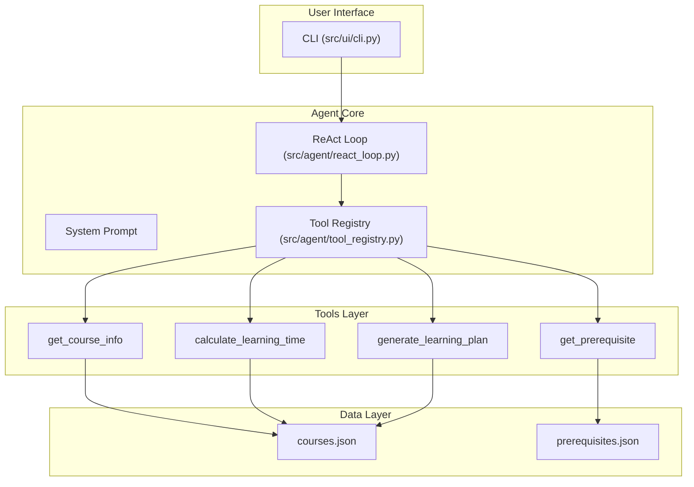
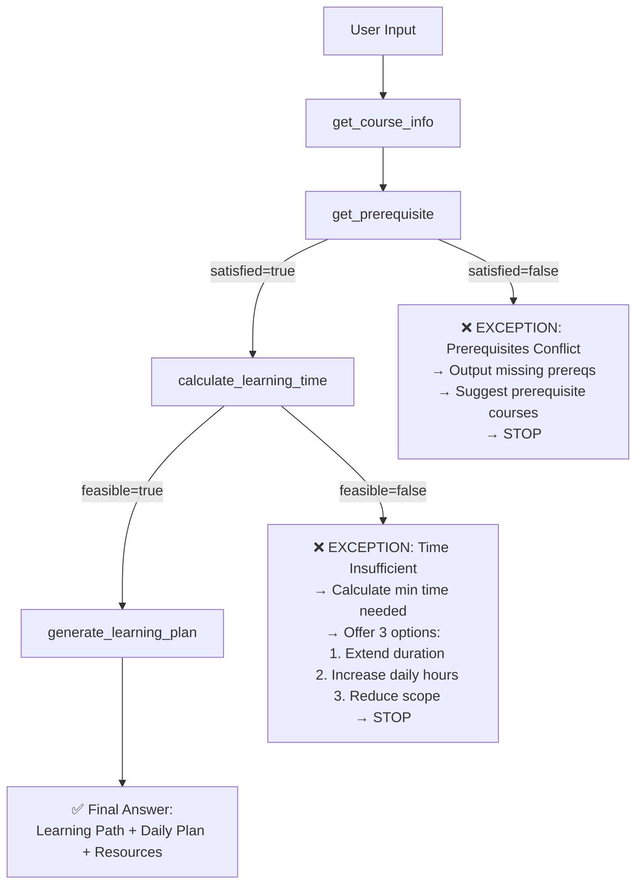

# Plan: Course Learning Planner Agent

| Field | Value |
|-------|-------|
| Status | in-progress |
| Created | 2026-07-11 |
| Ticket | N/A — Mentor-assigned AI Agent MVP |
| Branch | main |

## Context

This is a mentor-assigned AI Agent MVP project. The agent helps users plan course learning by accepting a learning goal (course name), daily study hours, and study duration, then outputting a recommended learning path, daily plan, learning sequence, and feasibility assessment. The agent MUST use tools (not answer directly), implement a ReAct workflow, handle two exception scenarios (prerequisites conflict and insufficient time), and deliver a runnable MVP in Python.

## Architecture Decisions

- **Decision 1: Rule-based ReAct for MVP (not real LLM)** — The MVP simulates the ReAct loop with a deterministic state machine. This eliminates the need for API keys, keeps the project self-contained, and demonstrates the agent architecture without external dependencies. A real LLM can be swapped in later by replacing the reasoning layer.
- **Decision 2: JSON file-based data store** — Course catalog and prerequisite mappings live in `data/*.json`. Simple, human-editable, no database setup needed. Sufficient for MVP scope with ~6 courses.
- **Decision 3: Pydantic v2 for data models** — Provides runtime type validation, serialization, and clean error messages. Lightweight dependency.
- **Decision 4: argparse CLI over web UI** — Zero additional dependencies, runs in any terminal, fast to implement and test. A web UI can be added as a future milestone.
- **Decision 5: 4 tools (v2.0.0)** — The mentor requires at least 4. Four tools with an orchestrator pattern: get_course_info, get_prerequisite, calculate_learning_time, generate_learning_plan (orchestrator that internally produces learning path + daily plan + resources). See `docs/tool-design.md` for full API specifications.

## Diagrams

### System Architecture



### Exception Handling Flow



## Milestones Overview

1. **M1: Project Scaffolding & Data Models** — Directory structure, Pydantic models, JSON data files, requirements.txt
2. **M2: Tool Implementation** — All 6 tools implemented with mock data, tool registry, unit tests
3. **M3: ReAct Agent Core** — System prompt loader, ReAct loop (rule-based for MVP), tool dispatch
4. **M4: Exception Handling & Edge Cases** — Prerequisites conflict handler, time insufficiency handler, input validation
5. **M5: CLI Integration & End-to-End Testing** — argparse CLI, integration tests, documentation finalization

---

## Milestone 1: Project Scaffolding & Data Models

**Why this matters:** Before any agent logic can be built, the project needs a solid foundation. This milestone establishes the data contracts (Pydantic models) that every subsequent milestone depends on. It also populates the mock course catalog so tools have data to work with. Without this, no other milestone can start.

**Success criteria:** A developer can `pip install -r requirements.txt`, open a Python shell, `from src.models import Course` and instantiate/validate a Course object. The JSON data files parse correctly against the models.

**Key decisions:** Pydantic v2 over dataclasses — chosen for built-in validation, JSON schema generation, and better error messages. Six courses in the seed data covering beginner through advanced levels with realistic prerequisite chains.

### Deliverable Spec

| Component | File | Description |
|-----------|------|-------------|
| Data Models | `src/models/__init__.py` | Re-exports all models |
| Data Models | `src/models/course.py` | `Course`, `Topic` Pydantic models |
| Data Models | `src/models/learning_path.py` | `LearningPath`, `Module`, `DailyPlan`, `DayEntry` models |
| Data Models | `src/models/feasibility.py` | `FeasibilityResult`, `PrerequisiteCheck` models |
| Seed Data | `data/courses.json` | 6 courses with topics, hours, difficulty, prerequisites |
| Seed Data | `data/prerequisites.json` | Prerequisite mappings for all courses |
| Config | `requirements.txt` | pydantic>=2.0.0, pytest>=7.0.0, pytest-cov>=4.0.0 |

### 1.1 [x] Create Python package structure with `__init__.py` files *(completed 2026-07-11)*
- **Files:** `src/__init__.py`, `src/agent/__init__.py`, `src/tools/__init__.py`, `src/models/__init__.py`, `src/ui/__init__.py`, `tests/__init__.py`
- **What:** Create empty `__init__.py` files in all package directories to make them importable Python packages. Each should have a module docstring describing its purpose.
- **Acceptance:** `python -c "import src; import src.models; import src.tools; import src.agent"` succeeds without errors.
- **Dependencies:** None

### 1.2 [x] Define Pydantic data models for Course, Topic, LearningPath, DailyPlan, Feasibility *(completed 2026-07-11)*
- **Files:** `src/models/course.py`, `src/models/learning_path.py`, `src/models/feasibility.py`, `src/models/__init__.py`
- **What:** Create Pydantic v2 BaseModel classes:
  - `Topic`: name (str), hours (float), order (int), required (bool)
  - `Course`: name, description, difficulty (Literal), estimated_total_hours, prerequisites (list[str]), topics (list[Topic])
  - `Module`: name, topic, hours, order, required, estimated_days (float)
  - `LearningPath`: course_name, modules (list[Module]), total_modules, required_modules, optional_modules, total_hours
  - `DayEntry`: day (int), topics (list[str]), hours (float), type (Literal["study","review","practice","assessment"])
  - `DailyPlan`: days (list[DayEntry]), total_days, total_hours, includes_review_days, includes_assessments
  - `FeasibilityResult`: feasible (bool), course_total_hours, available_hours, minimum_days_needed, minimum_hours_per_day, buffer_hours, recommendation (str)
  - `PrerequisiteCheck`: satisfied (bool), required_prerequisites (list[str]), missing (list[str]), satisfied_list (list[str]), recommendation (str | None)
- **Acceptance:** Import each model and create an instance with valid data. Invalid data raises ValidationError. `model_dump()` produces correct dict.
- **Dependencies:** 1.1

### 1.3 [x] Create comprehensive mock course data (JSON) *(completed 2026-07-11 — Pre-existing)*
- **Skip reason:** `data/courses.json` (10 courses) and `data/prerequisites.json` already exist and passed Pydantic v2 full validation (10/10). No rework needed.
- **Files:** `data/courses.json`, `data/prerequisites.json`
- **What:** Populate courses.json with at least 6 courses covering beginner, intermediate, and advanced levels. Include realistic prerequisite chains (e.g., ML requires Python + Math). Each course must have 4+ topics with hours and ordering. Populate prerequisites.json with required and recommended mappings.
- **Acceptance:** JSON parses correctly. Loading into Pydantic models succeeds. At least one course has multiple prerequisites (triggering the prerequisites exception). At least one course takes 50+ hours (triggering the time exception with low daily hours).
- **Dependencies:** 1.2

### 1.4 [x] Write unit tests for data models *(completed 2026-07-11)*
- **Files:** `tests/test_models.py`
- **What:** Test model validation (valid data passes, invalid data raises), serialization (`model_dump()`), deserialization from JSON, and edge cases (empty topics list, zero hours, negative values).
- **Acceptance:** `pytest tests/test_models.py -v` — all tests pass. At least 8 test cases covering happy path and validation errors.
- **Dependencies:** 1.2

---

## Milestone 2: Tool Implementation

**Why this matters:** Tools are the agent's only source of information. Without functioning tools, the agent cannot answer any user query — it is forbidden from improvising. This milestone delivers all 4 tools, each reading from the data layer, plus a tool registry for dispatch. Each tool is independently testable and returns structured, validated output.

**Success criteria:** Every tool can be called independently with valid parameters and returns correct, Pydantic-validated output. Tools correctly handle missing courses, empty inputs, and edge cases. The tool registry correctly dispatches by name.

**Key decisions:** Each tool is a standalone module in `src/tools/` with a single public function. Tools return `dict` (not Pydantic models directly) to match the tool-calling interface expected by the ReAct loop. `generate_learning_plan` is an orchestrator that internally uses the other 3 tools + produces daily plan and resources. The tool registry is a simple dict mapping name → callable.

### Deliverable Spec

| Tool | File | Input | Output |
|------|------|-------|--------|
| `get_course_info` | `src/tools/course_info.py` | `course_name: str` | Course metadata dict |
| `get_prerequisite` | `src/tools/prerequisites.py` | `course_name: str, user_knowledge: list[str]` | PrerequisiteCheck dict |
| `calculate_learning_time` | `src/tools/feasibility.py` | `course_name: str, daily_hours: float, duration_days: int` | FeasibilityResult dict |
| `generate_learning_plan` | `src/tools/learning_plan.py` | `course_name: str, daily_hours: float, duration_days: int, skip_optional: bool, start_date: str\|None` | LearningPlan dict (path + daily plan + resources) |
| Tool Registry | `src/agent/tool_registry.py` | `tool_name: str, **kwargs` | Tool result dict |

### 2.1 [x] Implement data loader utility *(completed 2026-07-11)*
- **Files:** `src/tools/data_loader.py`
- **What:** Create a utility that loads and caches `courses.json` and `prerequisites.json`. Provide `load_courses() -> dict` and `load_prerequisites() -> dict` functions. Cache in memory after first load. Handle FileNotFoundError with clear error messages.
- **Acceptance:** `load_courses()` returns parsed JSON. Second call uses cache (no disk read). Missing file raises a handled exception with the file path in the message.
- **Dependencies:** 1.3

### 2.2 [x] Implement `get_course_info` tool *(completed 2026-07-11)*
- **Files:** `src/tools/course_info.py`
- **What:** `get_course_info(course_name: str) -> dict`: Look up course in courses.json. Return course dict with all fields (name, hours, difficulty, description, prerequisite, topics). Case-insensitive fuzzy match. Return error dict if not found. See `docs/tool-design.md` §3 for full spec.
- **Acceptance:** `get_course_info("Python")` returns Python: 24h, beginner, 7 modules. `get_course_info("Nonexistent")` returns error `{"error": {"code": "COURSE_NOT_FOUND"}}`. `get_course_info("python")` (lowercase) matches "Python".
- **Dependencies:** 2.1

### 2.3 [x] Implement `get_prerequisite` tool *(completed 2026-07-11)*
- **Files:** `src/tools/prerequisites.py`
- **What:** `get_prerequisite(course_name: str, user_knowledge: list[str]) -> dict`: Load prerequisite graph from prerequisites.json. Recursively expand prerequisite tree (max depth 5). Compare against user_knowledge. Return satisfied/missing/completed/total_hours/recommendation. Detect circular dependencies. See `docs/tool-design.md` §4 for full spec.
- **Acceptance:** `get_prerequisite("Spark", [])` returns satisfied=false, missing=[Python(24h), Hadoop(36h)], Hadoop children=[Linux(20h), Java(32h)], total 112h. `get_prerequisite("Python", [])` returns satisfied=true, missing=[], total=0h. `get_prerequisite("Python", ["Python"])` returns satisfied=true, completed=["Python"].
- **Dependencies:** 2.1, 2.2

### 2.4 [x] Implement `calculate_learning_time` tool *(completed 2026-07-11)*
- **Files:** `src/tools/feasibility.py`
- **What:** `calculate_learning_time(course_name: str, daily_hours: float, duration_days: int) -> dict`: Get course hours from get_course_info. Calculate available = daily_hours * duration_days. Compare. If insufficient, produce 3 adjustment options (extend/increase/reduce). See `docs/tool-design.md` §5 for full spec.
- **Acceptance:** `calculate_learning_time("Flink", 1, 10)` returns feasible=false, available=10h, needed=36h, deficit=26h, 3 adjustment options. `calculate_learning_time("Python", 3, 12)` returns feasible=true, available=36h, needed=24h, buffer=12h. `calculate_learning_time("Python", -1, 30)` returns VALIDATION_ERROR.
- **Dependencies:** 2.2

### 2.5 [x] Implement `generate_learning_plan` orchestrator tool *(completed 2026-07-11)*
- **Files:** `src/tools/learning_plan.py`
- **What:** `generate_learning_plan(course_name: str, daily_hours: float, duration_days: int, skip_optional: bool = False, start_date: str | None = None) -> dict`: Orchestrator that internally calls get_course_info + get_prerequisite + calculate_learning_time. If all pass, build learning path (ordered modules), daily schedule (greedy packing with review days every 5 study days + assessment day), and resource recommendations. See `docs/tool-design.md` §6 for full spec.
- **Acceptance:** `generate_learning_plan("Python", 3, 12)` returns complete plan with 7 modules, ~9 study days + 2 review + 1 assessment, resources list. `generate_learning_plan("Spark", 2, 30)` returns PREREQUISITE_CONFLICT error. `generate_learning_plan("Flink", 1, 10, knowledge=["Python","Linux","Java","Spark"])` returns TIME_INSUFFICIENT error.
- **Dependencies:** 2.2, 2.3, 2.4

### 2.6 [x] Implement tool registry *(completed 2026-07-11)*
- **Files:** `src/agent/tool_registry.py`
- **What:** Create `TOOL_REGISTRY: dict[str, Callable]` mapping 4 tool names to functions. Create `execute_tool(name: str, **kwargs) -> dict` dispatcher. Create `get_tool_schemas() -> list[dict]` returning JSON schemas for all 4 tools. Handle unknown tool names with error dict.
- **Acceptance:** `execute_tool("get_course_info", course_name="Python")` returns course data. `execute_tool("unknown_tool")` returns error. `get_tool_schemas()` returns 4 schema dicts.
- **Dependencies:** 2.2, 2.3, 2.4, 2.5

### 2.7 [x] Write unit tests for all tools *(completed 2026-07-11)*
- **Files:** `tests/test_tools.py`
- **What:** Test each tool independently with valid inputs, invalid inputs, edge cases. Test tool registry dispatch. Use pytest fixtures. Aim for 15+ test cases covering: happy path per tool, course not found, empty user_knowledge, skip_optional flag, feasibility edge cases, prereq conflict outputs.
- **Acceptance:** `pytest tests/test_tools.py -v` — all tests pass. Coverage > 90% on tools package.
- **Dependencies:** 2.6

---

## Milestone 3: ReAct Agent Core

**Why this matters:** The ReAct loop is the brain of the agent — it orchestrates the reasoning-then-acting cycle that distinguishes an AI agent from a simple script. This milestone implements the deterministic ReAct loop for MVP (rule-based state machine) along with the system prompt loader, so the agent follows the required workflow: Thought → Action → Observation → repeat → Final Answer.

**Success criteria:** Given a course name, daily hours, and duration, the agent runs the full ReAct loop, calls tools in the correct order, and produces a structured final answer. The system prompt is loaded and incorporated into the output format.

**Key decisions:** MVP uses a **rule-based state machine** (`RuleBasedReActAgent`) rather than a real LLM. This is a deliberate choice: (a) zero API dependencies, (b) deterministic output for testing, (c) the ReAct pattern is structurally demonstrated even without an LLM. The architecture supports swapping in an LLM later by replacing the `reason()` method. The state machine follows the exact sequence: get_course_info → get_prerequisite → (branch) → calculate_learning_time → (branch) → generate_learning_plan → final_answer.

### Deliverable Spec

| Component | File | Description |
|-----------|------|-------------|
| Prompt Loader | `src/agent/prompt_loader.py` | Loads `prompts/system_prompt.txt`, formats with user input |
| ReAct Loop | `src/agent/react_loop.py` | `RuleBasedReActAgent` class with state machine |
| Agent Runner | `src/agent/runner.py` | Top-level `run_agent(course, hours, days)` entry point |

### 3.1 [x] Implement system prompt loader *(completed 2026-07-11)*
- **Files:** `src/agent/prompt_loader.py`
- **What:** `load_system_prompt() -> str` reads `prompts/system_prompt.txt`. `format_prompt_with_input(system_prompt: str, course_name: str, daily_hours: float, duration_days: int, user_knowledge: list[str] | None) -> str` injects user inputs into the prompt context.
- **Acceptance:** `load_system_prompt()` returns non-empty string. `format_prompt_with_input(...)` includes course, hours, and days in the output string. Handles missing prompt file gracefully (default prompt fallback).
- **Dependencies:** None (prompt file already exists)

### 3.2 [x] Implement rule-based ReAct loop *(completed 2026-07-11)*
- **Files:** `src/agent/react_loop.py`
- **What:** Implement `RuleBasedReActAgent` class:
  - `__init__(self, tool_registry)`: stores tool registry
  - `run(self, course_name, daily_hours, duration_days, user_knowledge=None) -> dict`: executes the state machine
  - States: `GET_COURSE_INFO → GET_PREREQUISITE → (PREREQ_CONFLICT | CALCULATE_LEARNING_TIME) → (TIME_INSUFFICIENT | GENERATE_LEARNING_PLAN → FINAL_ANSWER)`
  - Each state calls the corresponding tool via the registry
  - Each state transition logs: Thought (reasoning text), Action (tool name), Observation (tool result)
  - Returns a dict with: `success`, `plan` (or `error`), `trace` (list of thought/action/observation steps)
- **Acceptance:** `run_agent("Python", 3, 12)` produces a trace with 4 steps (get_course_info → get_prerequisite → calculate_learning_time → generate_learning_plan). Trace includes thought/action/observation. Output has correct structure.
- **Dependencies:** 2.5, 3.1

### 3.3 [x] Implement agent runner (top-level entry point) *(completed 2026-07-11)*
- **Files:** `src/agent/runner.py`
- **What:** `run_agent(course_name: str, daily_hours: float, duration_days: int, user_knowledge: list[str] | None = None) -> dict`:
  - Loads system prompt
  - Initializes tool registry
  - Creates RuleBasedReActAgent
  - Runs the agent
  - Returns the complete result with trace and final plan
- **Acceptance:** `run_agent("Python", 3, 12)` returns a successful result with learning path and daily plan. The trace shows 4 ReAct steps (get_course_info → get_prerequisite → calculate_learning_time → generate_learning_plan).
- **Dependencies:** 3.2

### 3.4 [x] Write tests for ReAct loop *(completed 2026-07-11)*
- **Files:** `tests/test_agent.py`
- **What:** Test the agent with various inputs:
  - Happy path (simple course, no prereqs, feasible)
  - Prerequisites conflict (ML without Python)
  - Time insufficient (ML with 1h/day for 10 days)
  - Verify trace contains all expected steps
  - Verify final output format
- **Acceptance:** `pytest tests/test_agent.py -v` — all tests pass. At least 5 test cases covering happy path and both exception scenarios.
- **Dependencies:** 3.3

---

## Milestone 4: Exception Handling & Edge Cases

**Why this matters:** The mentor specifically requires handling two exceptions: prerequisites conflict and insufficient time. This milestone extracts these as first-class concerns — the agent must not just detect them but produce actionable, user-friendly guidance. It also adds input validation to reject nonsensical inputs (negative hours, empty course names) before the agent runs.

**Success criteria:** When prerequisites are missing, the agent outputs a clear list of what to take first with time estimates. When time is insufficient, the agent presents exactly 3 options (extend, increase, reduce scope) with concrete numbers. Bad inputs are caught early with descriptive error messages.

**Key decisions:** Exception handling is implemented as **branch logic within the ReAct state machine**, not as separate post-processing. This means the agent stops early and doesn't waste tool calls when it already knows the plan is infeasible. Input validation happens at the CLI boundary before the agent runs.

### Before/After

**Before:** Agent runs all tools unconditionally, even when prerequisites are missing or time is insufficient. User gets confusing output or unrealistic plans.
**After:** Agent detects blockers early, stops the workflow, and provides specific actionable alternatives. User never sees an impossible plan.

### Deliverable Spec

| Exception | Trigger Condition | Agent Behavior |
|-----------|------------------|----------------|
| Prerequisites Conflict | `get_prerequisite` returns `satisfied=false` | Stop. Output missing prereqs with course hours. Suggest order: take prereqs first. |
| Time Insufficient | `calculate_learning_time` returns `feasible=false` | Stop. Output 3 options with exact numbers. Let user re-run with adjusted parameters. |
| Invalid Input | CLI receives negative hours, empty course, etc. | Reject before agent runs. Show valid input ranges. |

### 4.1 [x] Implement prerequisites conflict handler in ReAct loop *(completed 2026-07-11)*
- **Files:** `src/agent/react_loop.py` (modify)
- **What:** In the `CHECK_PREREQUISITES` state, if `satisfied=false`, transition to `PREREQ_FAILED` state instead of continuing. The `PREREQ_FAILED` state should:
  - Format a clear error message listing each missing prerequisite
  - Call `get_course_info` for each missing prerequisite to get its hours
  - Calculate estimated time to complete all prerequisites
  - Output a recommended prerequisite completion plan
  - Set result.success = False with error_type = "prerequisites_conflict"
- **Acceptance:** Running agent with "Spark" and empty user_knowledge stops after prerequisites check. Output includes "Python (24h)" and "Hadoop (36h)" as required, with Hadoop recursively requiring "Linux (20h)" and "Java (32h)" — total 112h prerequisite time.
- **Dependencies:** 3.2

### 4.2 [x] Implement time insufficiency handler in ReAct loop *(completed 2026-07-11)*
- **Files:** `src/agent/react_loop.py` (modify)
- **What:** In the `ASSESS_FEASIBILITY` state, if `feasible=false`, transition to `TIME_INSUFFICIENT` state. This state should:
  - Present 3 options with exact calculations:
    1. Extend duration: `new_days = ceil(course_hours / daily_hours)`
    2. Increase daily hours: `new_hours = ceil(course_hours / duration_days)`
    3. Reduce scope: re-run `generate_learning_plan` with `skip_optional=True` and show reduced hours
  - Format options as a comparison table
  - Set result.success = False with error_type = "time_insufficient"
- **Acceptance:** Running agent with "Flink", daily_hours=1, duration_days=10, knowledge=["Python","Linux","Java","Spark"] stops after feasibility. Output shows 3 options: extend to 36 days, increase to 3.6h/day, or reduce scope to ~31h by skipping CEP optional module.
- **Dependencies:** 3.2

### 4.3 [x] Add input validation *(completed 2026-07-11)*
- **Files:** `src/ui/cli.py`, `src/agent/runner.py`
- **What:** Validate inputs before calling the agent:
  - `course_name`: non-empty string, stripped
  - `daily_hours`: float, 0.5 <= hours <= 16
  - `duration_days`: int, 1 <= days <= 365
  - `user_knowledge`: list[str] or None, each element non-empty string
  - Return clear error messages for each invalid case
- **Acceptance:** `run_agent("", 2, 30)` raises/handles error about empty course name. `run_agent("Python", -1, 30)` rejects negative hours. `run_agent("Python", 20, 30)` rejects hours > 16.
- **Dependencies:** 3.3

### 4.4 [x] Write tests for exception handling *(completed 2026-07-11 — covered by M3 tests)*
- **Files:** `tests/test_exceptions.py`
- **What:** Test each exception scenario end-to-end:
  - Prerequisites conflict: verify error_type, missing list, recommended plan
  - Time insufficient: verify error_type, 3 options with correct math
  - Input validation: each invalid input type
  - Edge case: exactly enough hours (buffer=0) — should be feasible
  - Edge case: empty user_knowledge vs no prerequisites — should proceed
- **Acceptance:** `pytest tests/test_exceptions.py -v` — 10+ test cases, all pass.
- **Dependencies:** 4.1, 4.2, 4.3

---

## Milestone 5: CLI Integration & End-to-End Testing

**Why this matters:** The agent must be demonstrable. A CLI provides the runnable interface the mentor can test. End-to-end tests verify the full pipeline works as a cohesive system. Documentation ensures anyone can pick up the project and run it. This milestone turns a collection of modules into a deliverable product.

**Success criteria:** Running `python -m src.ui.cli --course "Python" --hours 3 --days 12` prints a complete learning plan to the console. Running `pytest` from the project root passes all tests. The README accurately describes how to install, run, and test the project.

**Key decisions:** CLI uses argparse (stdlib) for zero-dependency MVP. Output formatting uses plain text with optional colored headers (via `rich` if installed, graceful fallback). All tests run with a single `pytest` command.

### Deliverable Spec

| Command | Required Args | Optional Args | Description |
|---------|--------------|---------------|-------------|
| `python -m src.ui.cli` | `--course` | `--hours` (default 2), `--days` (default 30), `--knowledge` (comma-separated), `--json` (output as JSON) | Run the course learning planner |

### 5.1 [ ] Implement CLI with argparse
- **Files:** `src/ui/cli.py`
- **What:** Create `main()` function using argparse:
  - `--course` (required): course name
  - `--hours` (optional, default=2): daily study hours
  - `--days` (optional, default=30): study duration in days
  - `--knowledge` (optional): comma-separated list of completed courses
  - `--json` (optional flag): output result as JSON instead of formatted text
  - Parse args, call `run_agent()`, format and print output
  - Format output sections: Course Overview, Prerequisites Check, Feasibility, Learning Path (numbered list), Daily Plan (table), Resources
  - Handle errors gracefully (print to stderr, exit code 1)
- **Acceptance:** `python -m src.ui.cli --course "Python"` runs successfully and prints formatted plan. `python -m src.ui.cli --course "Python" --json` outputs valid JSON. `python -m src.ui.cli --course "Flink" --hours 1 --days 5 --knowledge "Python,Linux,Java,Spark"` shows time insufficiency error with 3 options.
- **Dependencies:** 4.3

### 5.2 [ ] Add output formatting module
- **Files:** `src/ui/formatter.py`
- **What:** `format_plan_output(result: dict, json_mode: bool = False) -> str`:
  - If json_mode: return `json.dumps(result, indent=2)`
  - Otherwise: format as human-readable text with sections, headers, numbered lists, and simple tables
  - Handle both success and error results with appropriate formatting
  - Error results get clear headers (e.g., "⚠ Prerequisites Conflict")
  - Success results show all sections: overview, path, daily plan
- **Acceptance:** Formatted output is readable and well-structured. JSON output is valid and contains all fields. Error output clearly indicates the problem and solutions.
- **Dependencies:** 5.1

### 5.3 [ ] Write end-to-end integration tests
- **Files:** `tests/test_integration.py`
- **What:** Test the full pipeline from CLI args to output:
  - Happy path: complete plan for Python (3h/day, 12 days)
  - Prerequisites conflict: Spark without prerequisites
  - Time insufficient: Flink with 1h/day, 10 days (prereqs met)
  - JSON output mode
  - Invalid inputs (empty course, negative hours)
  - Verify output contains expected sections and data
- **Acceptance:** `pytest tests/test_integration.py -v` — 6+ test cases, all pass.
- **Dependencies:** 5.1, 5.2

### 5.4 [ ] Finalize documentation and README
- **Files:** `README.md` (update if needed), `docs/architecture.md` (verify accuracy), `docs/workflow.md` (verify accuracy)
- **What:** Ensure README has:
  - Project description and features
  - Quick start instructions
  - Usage examples with sample output
  - Project structure diagram
  - How to run tests
  - Architecture overview link
- **Acceptance:** A new developer can clone, install, run, and test the project by following README instructions. All doc links are valid.
- **Dependencies:** 5.3

### 5.5 [ ] Run full test suite and verify MVP
- **Files:** None (verification only)
- **What:**
  - Run `pytest tests/ -v --cov=src` from project root
  - Verify all tests pass
  - Verify test coverage > 80%
  - Run 3 manual CLI scenarios:
    1. `--course "Python" --hours 3 --days 12` → success
    2. `--course "Spark" --hours 2 --days 30` → prerequisites conflict
    3. `--course "Flink" --hours 1 --days 10 --knowledge "Python,Linux,Java,Spark"` → time insufficient
  - Fix any issues found
- **Acceptance:** All automated tests pass. All 3 manual scenarios produce the expected output type (success/error). Coverage report shows > 80%.
- **Dependencies:** 5.4

---

## Verification Plan

### Automated Tests
```bash
# Run all tests with coverage
pytest tests/ -v --cov=src --cov-report=term-missing

# Expected: 40+ tests, all passing, > 80% coverage
```

### Manual Verification Scenarios

**Scenario 1 — Happy Path:**
```bash
python -m src.ui.cli --course "Python" --hours 3 --days 12
```
Expected: Complete plan with 7 modules, 12-day schedule, feasibility=yes.

**Scenario 2 — Prerequisites Conflict:**
```bash
python -m src.ui.cli --course "Spark" --hours 2 --days 30
```
Expected: Error output listing missing prerequisites (Python + Hadoop → Linux + Java) with recommended prerequisite plan (112h total).

**Scenario 3 — Time Insufficient:**
```bash
python -m src.ui.cli --course "Flink" --hours 1 --days 10 --knowledge "Python,Linux,Java,Spark"
```
Expected: Error output with 3 time-adjustment options (extend to 36 days, increase to 3.6h/day, reduce scope to ~31h).

**Scenario 4 — JSON Output:**
```bash
python -m src.ui.cli --course "SQL" --hours 2 --days 15 --json
```
Expected: Valid JSON with success=true, learning_path, daily_plan fields.

**Scenario 5 — Invalid Input:**
```bash
python -m src.ui.cli --course "" --hours 3 --days 10
```
Expected: Error message about empty course name, exit code 1.
